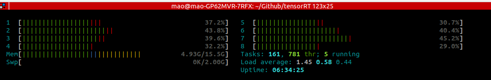
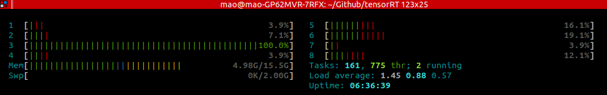
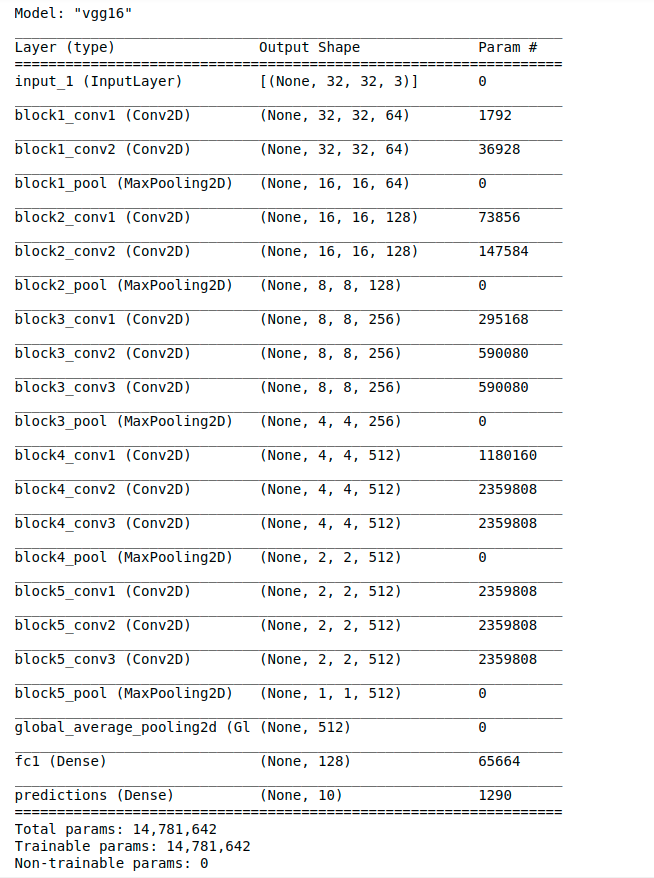

# 为什么使用tensorflow lite
可以看看下面的链接:
+ [TensorFlow Lite调研](https://zhuanlan.zhihu.com/p/44284855)
+ [Google I/O 2017推出的Tensorflow Lite有什么意义](https://www.zhihu.com/question/59994763)

使用tensorflow lite的目的主要在于优化模型的体积和延迟,在牺牲一定精度的基础上

考虑到模型训练图片的大小问题,我们采用ImageNet上训练好的MobileNetV2模型来做演示(为什么采用ImageNet的原因是,训练图片大小为224x224x3,眼睛可以很明显的认出图片的类别)

训练好的MobileNetV2[来自于keras的.h5文件](https://github.com/fchollet/deep-learning-models/releases),下面的代码是保存mobilenetv2.h5,[MobileNetV2的官方代码](https://github.com/keras-team/keras-applications/blob/master/keras_applications/mobilenet_v2.py)
```
import os
from tensorflow.keras.applications.mobilenet_v2 import MobileNetV2 as Net

model = Net(weights='imagenet')

os.makedirs('./model', exist_ok=True)

# Save the h5 file to path specified.
model.save("./model/mobilenetv2.h5")
```

我们采用的方法是从tensorflow frozen graph转化成tensorflow lite flatbuffer,下面的代码是把mobilenetv2.h5转化成fp32_frozen_graph.pb
```
import tensorflow as tf
from tensorflow.python.framework import graph_io
from tensorflow.keras.models import load_model


# Clear any previous session.
tf.keras.backend.clear_session()

save_pb_dir = './model'
model_fname = './model/mobilenetv2.h5'
def freeze_graph(graph, session, output, save_pb_dir='.', save_pb_name='fp32_frozen_graph.pb', save_pb_as_text=False):
    with graph.as_default():
        graphdef_inf = tf.graph_util.remove_training_nodes(graph.as_graph_def())
        graphdef_frozen = tf.graph_util.convert_variables_to_constants(session, graphdef_inf, output)
        graph_io.write_graph(graphdef_frozen, save_pb_dir, save_pb_name, as_text=save_pb_as_text)
        return graphdef_frozen

# This line must be executed before loading Keras model.
tf.keras.backend.set_learning_phase(0) 

model = load_model(model_fname)

session = tf.keras.backend.get_session()

input_names = [t.op.name for t in model.inputs]
output_names = [t.op.name for t in model.outputs]

# Prints input and output nodes names, take notes of them.
print(input_names, output_names)

fp32_frozen_graph = freeze_graph(session.graph, session, [out.op.name for out in model.outputs], save_pb_dir=save_pb_dir)
```
输出的input_names是['input_1'],ouput_names是 ['Logits/Softmax']
转化成frozen graph过程中的一些信息,INFO:tensorflow:Froze 262 variables.   INFO:tensorflow:Converted 262 variables to const ops.

接下来的代码是把fp32_frozen_graph.pb转化成fp32_frozen_graph.tflite
```
import tensorflow as tf

graph_def_file = "./model/fp32_frozen_graph.pb"
input_arrays = ["input_1"]
output_arrays = ['Logits/Softmax']

converter = tf.lite.TFLiteConverter.from_frozen_graph(
  graph_def_file, input_arrays, output_arrays)
tflite_model = converter.convert()
open("./model/fp32_frozen_graph.tflite", "wb").write(tflite_model)
```

若要把fp32_frozen_graph.pb转化成int8_frozen_graph.tflite,我们需要添加一步calibration,首先读取一张图片
```
import numpy as np
import tensorflow as tf
from tensorflow.keras.preprocessing import image
from tensorflow.keras.applications.mobilenet_v2 import preprocess_input, decode_predictions
import numpy as np
# Optional image to test model prediction.
img_path = './elephant.jpg'

image_size = [224, 224, 3]
img = image.load_img(img_path, target_size=image_size[:2])
x = image.img_to_array(img)
x = np.expand_dims(x, axis=0)
x = preprocess_input(x)
```
然后我们声明一个calibration_input_fn_gen函数
```
num_calibration_batches = 2
BATCH_SIZE = 1
batched_input = np.zeros((BATCH_SIZE * num_calibration_batches, 224, 224, 3), dtype=np.float32)

config = tf.ConfigProto()
config.gpu_options.allow_growth=True
with tf.Session(graph=tf.Graph(), config=config) as sess:
    # prepare dataset iterator
    next_element = tf.convert_to_tensor(x)
    for i in range(num_calibration_batches):
        print(batched_input[i*BATCH_SIZE:(i+1)*BATCH_SIZE, :].shape, sess.run(next_element).shape)
        batched_input[i*BATCH_SIZE:(i+1)*BATCH_SIZE, :] = sess.run(next_element)

#batched_input = tf.constant(batched_input)
print('Calibration data shape: ', batched_input.shape)

def calibration_input_fn_gen():
    for i in range(num_calibration_batches):
        yield [batched_input[i*BATCH_SIZE:(i+1)*BATCH_SIZE, :]]
        
calibration_input_fn = calibration_input_fn_gen()
```
输出结果为:
(1, 224, 224, 3) (1, 224, 224, 3)
(1, 224, 224, 3) (1, 224, 224, 3)
Calibration data shape:  (2, 224, 224, 3)

之后我们就可以进行转换了
```
import tensorflow as tf

graph_def_file = "./model/fp32_frozen_graph.pb"
input_arrays = ["input_1"]
output_arrays = ['Logits/Softmax']

converter = tf.lite.TFLiteConverter.from_frozen_graph(
  graph_def_file, input_arrays, output_arrays)
converter.optimizations = [tf.lite.Optimize.DEFAULT]
converter.representative_dataset = calibration_input_fn_gen
tflite_model = converter.convert()
open("./model/int8_frozen_graph.tflite", "wb").write(tflite_model)
```

为了方便测试fp32和int8的推断速度,我们先声明一个tfLiteInference函数
```
def tfLiteInference(input_details, interpreter, output_details, x):
    interpreter.set_tensor(input_details[0]['index'], x)

    interpreter.invoke()

    # The function `get_tensor()` returns a copy of the tensor data.
    # Use `tensor()` in order to get a pointer to the tensor.
    output_data = interpreter.get_tensor(output_details[0]['index'])
    
    return output_data
```

# 测试FP32的.tflite
先读取图片
```
import numpy as np
import tensorflow as tf
from tensorflow.keras.preprocessing import image
from tensorflow.keras.applications.mobilenet_v2 import preprocess_input, decode_predictions

# Load TFLite model and allocate tensors.
interpreter = tf.lite.Interpreter(model_path="./model/fp32_frozen_graph.tflite")
interpreter.allocate_tensors()

# Get input and output tensors.
input_details = interpreter.get_input_details()
output_details = interpreter.get_output_details()

# Optional image to test model prediction.
img_path = './elephant.jpg'

image_size = [224, 224, 3]
img = image.load_img(img_path, target_size=image_size[:2])
x = image.img_to_array(img)
x = np.expand_dims(x, axis=0)
x = preprocess_input(x)
```

再把图片用于推断速度测试,显示FPS(frame per second)
```
# test FP32 CPU
import time
times = []

output_data = tfLiteInference(input_details, interpreter, output_details, x)

# decode the results into a list of tuples (class, description, probability)
# (one such list for each sample in the batch)
print('Predicted:', decode_predictions(output_data, top=3)[0])

for i in range(2000):
    start_time = time.time()
    output_data = tfLiteInference(input_details, interpreter, output_details, x)
    delta = (time.time() - start_time)
    times.append(delta)
mean_delta = np.array(times).mean()
fps = 1 / mean_delta
print('average(sec):{:.2f},fps:{:.2f}'.format(mean_delta, fps))
```
输出结果为:
Predicted: [('n02504458', 'African_elephant', 0.40645647), ('n02504013', 'Indian_elephant', 0.26055372), ('n01871265', 'tusker', 0.14443965)]
average(sec):0.02,fps:63.26
此处我们可以看下CPU运行情况

我们发现调用了多核CPU,对于tensorflow lite来说desktop的GPU是不能调用的,不过在android等设备上可以通过GPU delegate来调用GPU

# 测试INT8的.tflite
先读取图片
```
import numpy as np
import tensorflow as tf
from tensorflow.keras.preprocessing import image
from tensorflow.keras.applications.mobilenet_v2 import preprocess_input, decode_predictions

# Load TFLite model and allocate tensors.
interpreter = tf.lite.Interpreter(model_path="./model/int8_frozen_graph.tflite")
interpreter.allocate_tensors()

# Get input and output tensors.
input_details = interpreter.get_input_details()
output_details = interpreter.get_output_details()

# Optional image to test model prediction.
img_path = './elephant.jpg'

image_size = [224, 224, 3]
img = image.load_img(img_path, target_size=image_size[:2])
x = image.img_to_array(img)
x = np.expand_dims(x, axis=0)
x = preprocess_input(x)
```

再把图片用于推断速度测试,显示FPS(frame per second)
```
# test INT8 CPU
import time
times = []

output_data = tfLiteInference(input_details, interpreter, output_details, x)

# decode the results into a list of tuples (class, description, probability)
# (one such list for each sample in the batch)
print('Predicted:', decode_predictions(output_data, top=3)[0])

for i in range(10):
    start_time = time.time()
    output_data = tfLiteInference(input_details, interpreter, output_details, x)
    delta = (time.time() - start_time)
    times.append(delta)
mean_delta = np.array(times).mean()
fps = 1 / mean_delta
print('average(sec):{:.2f},fps:{:.2f}'.format(mean_delta, fps))
```
Predicted: [('n02504458', 'African_elephant', 0.45703125), ('n02504013', 'Indian_elephant', 0.18359375), ('n01871265', 'tusker', 0.13671875)]
average(sec):0.95,fps:1.06
此处我们可以看下CPU运行情况

我们可以认为模型调用的是单核CPU,所以此处的推断速度很慢,这个问题还需要查下资料

# 测试FP32的.pb
```
output_names = ['Logits/Softmax']
input_names = ['input_1']

import tensorflow as tf


def get_frozen_graph(graph_file):
    """Read Frozen Graph file from disk."""
    with tf.gfile.FastGFile(graph_file, "rb") as f:
        graph_def = tf.GraphDef()
        graph_def.ParseFromString(f.read())
    return graph_def


trt_graph = get_frozen_graph('./model/fp32_frozen_graph.pb')

# Create session and load graph
tf_config = tf.ConfigProto()
tf_config.gpu_options.allow_growth = True
tf_sess = tf.Session(config=tf_config)
tf.import_graph_def(trt_graph, name='')


# Get graph input size
for node in trt_graph.node:
    if 'input_' in node.name:
        size = node.attr['shape'].shape
        image_size = [size.dim[i].size for i in range(1, 4)]
        break
print("image_size: {}".format(image_size))


# input and output tensor names.
input_tensor_name = input_names[0] + ":0"
output_tensor_name = output_names[0] + ":0"

print("input_tensor_name: {}\noutput_tensor_name: {}".format(
    input_tensor_name, output_tensor_name))

output_tensor = tf_sess.graph.get_tensor_by_name(output_tensor_name)
```
输出结果:
image_size: [224, 224, 3]
input_tensor_name: input_1:0
output_tensor_name: Logits/Softmax:0

```
from tensorflow.keras.preprocessing import image
from tensorflow.keras.applications.mobilenet_v2 import preprocess_input, decode_predictions
import numpy as np

# Optional image to test model prediction.
img_path = './data/elephant.jpg'

img = image.load_img(img_path, target_size=image_size[:2])
x = image.img_to_array(img)
x = np.expand_dims(x, axis=0)
x = preprocess_input(x)

feed_dict = {
    input_tensor_name: x
}
preds = tf_sess.run(output_tensor, feed_dict)

# decode the results into a list of tuples (class, description, probability)
# (one such list for each sample in the batch)
print('Predicted:', decode_predictions(preds, top=3)[0])
```
输出结果:Predicted: [('n02504458', 'African_elephant', 0.5241101), ('n01871265', 'tusker', 0.17158917), ('n02504013', 'Indian_elephant', 0.15654118)]

```
# test FP32
import time
times = []

one_prediction = tf_sess.run(output_tensor, feed_dict)

for i in range(2000):
    start_time = time.time()
    one_prediction = tf_sess.run(output_tensor, feed_dict)
    delta = (time.time() - start_time)
    times.append(delta)
mean_delta = np.array(times).mean()
fps = 1 / mean_delta
print('average(sec):{:.2f},fps:{:.2f}'.format(mean_delta, fps))
```
输出结果:average(sec):0.00,fps:272.44

# 模型大小比较
对于模型大小的比较,正常的mobilenetv2.h5为14.6MB
                                            fp32_frozen_graph.pb为14.2MB
                                            fp32_frozen_graph.tflite为14.0MB
                                            int8_frozen_graph.tflite为4.0MB
我们发现把weights和activation从FP32转换成INT8之后,模型体积减小了3.5x

# 模型速度比较
对于模型推断速度的比较,正常的fp32_frozen_graph.pb的FPS为272.44
                                                   fp32_frozen_grapn.tflite为63.26
                                                   int8_frozen_graph.tflite为1.06
tensorflow lite在desktop上调用不了GPU

# pruning+quantization
为了进一步压缩模型体积的大小,我们可以在训练过程中引入pruning,然后再进行quantization
## 导入包
```
import tensorflow as tf

import tempfile
import zipfile
import os
import numpy as np
from tensorflow_model_optimization.sparsity import keras as sparsity
```

## 准备数据
```
batch_size = 128
num_classes = 10
epochs = 10

# input image dimensions
img_rows, img_cols = 32, 32

# the data, shuffled and split between train and test sets
(x_train, y_train), (x_test, y_test) = tf.keras.datasets.cifar10.load_data()

if tf.keras.backend.image_data_format() == 'channels_first':
  x_train = x_train.reshape(x_train.shape[0], 1, img_rows, img_cols)
  x_test = x_test.reshape(x_test.shape[0], 1, img_rows, img_cols)
  input_shape = (1, img_rows, img_cols)
else:
  x_train = x_train.reshape(x_train.shape[0], img_rows, img_cols, 3)
  x_test = x_test.reshape(x_test.shape[0], img_rows, img_cols, 3)
  input_shape = (img_rows, img_cols, 3)

x_train = x_train.astype('float32')
x_test = x_test.astype('float32')
x_train /= 255
x_test /= 255
print('x_train shape:', x_train.shape)
print(x_train.shape[0], 'train samples')
print(x_test.shape[0], 'test samples')

# convert class vectors to binary class matrices
y_train = tf.keras.utils.to_categorical(y_train, num_classes)
y_test = tf.keras.utils.to_categorical(y_test, num_classes)
```
输出结果:
x_train shape: (50000, 32, 32, 3)
50000 train samples
10000 test samples

## 定义网络
```
from __future__ import absolute_import
from __future__ import division
from __future__ import print_function

import os


WEIGHTS_PATH = ('https://github.com/fchollet/deep-learning-models/'
                'releases/download/v0.1/'
                'vgg16_weights_tf_dim_ordering_tf_kernels.h5')
WEIGHTS_PATH_NO_TOP = ('https://github.com/fchollet/deep-learning-models/'
                       'releases/download/v0.1/'
                       'vgg16_weights_tf_dim_ordering_tf_kernels_notop.h5')

backend = tf.keras.backend
layers = tf.keras.layers
models = tf.keras.models
keras_utils = tf.keras.utils

def VGG16(include_top=False,
          weights='imagenet',
          input_tensor=None,
          input_shape=(32, 32, 3),
          pooling=None,
          classes=10,
          **kwargs):
    """Instantiates the VGG16 architecture.
    Optionally loads weights pre-trained on ImageNet.
    Note that the data format convention used by the model is
    the one specified in your Keras config at `~/.keras/keras.json`.
    # Arguments
        include_top: whether to include the 3 fully-connected
            layers at the top of the network.
        weights: one of `None` (random initialization),
              'imagenet' (pre-training on ImageNet),
              or the path to the weights file to be loaded.
        input_tensor: optional Keras tensor
            (i.e. output of `layers.Input()`)
            to use as image input for the model.
        input_shape: optional shape tuple, only to be specified
            if `include_top` is False (otherwise the input shape
            has to be `(224, 224, 3)`
            (with `channels_last` data format)
            or `(3, 224, 224)` (with `channels_first` data format).
            It should have exactly 3 input channels,
            and width and height should be no smaller than 32.
            E.g. `(200, 200, 3)` would be one valid value.
        pooling: Optional pooling mode for feature extraction
            when `include_top` is `False`.
            - `None` means that the output of the model will be
                the 4D tensor output of the
                last convolutional block.
            - `avg` means that global average pooling
                will be applied to the output of the
                last convolutional block, and thus
                the output of the model will be a 2D tensor.
            - `max` means that global max pooling will
                be applied.
        classes: optional number of classes to classify images
            into, only to be specified if `include_top` is True, and
            if no `weights` argument is specified.
    # Returns
        A Keras model instance.
    # Raises
        ValueError: in case of invalid argument for `weights`,
            or invalid input shape.
    """

    if not (weights in {'imagenet', None} or os.path.exists(weights)):
        raise ValueError('The `weights` argument should be either '
                         '`None` (random initialization), `imagenet` '
                         '(pre-training on ImageNet), '
                         'or the path to the weights file to be loaded.')

    if weights == 'imagenet' and include_top and classes != 1000:
        raise ValueError('If using `weights` as `"imagenet"` with `include_top`'
                         ' as true, `classes` should be 1000')

    if input_tensor is None:
        img_input = layers.Input(shape=input_shape)
    else:
        if not backend.is_keras_tensor(input_tensor):
            img_input = layers.Input(tensor=input_tensor, shape=input_shape)
        else:
            img_input = input_tensor
    # Block 1
    x = layers.Conv2D(64, (3, 3),
                      activation='relu',
                      padding='same',
                      name='block1_conv1')(img_input)
    x = layers.Conv2D(64, (3, 3),
                      activation='relu',
                      padding='same',
                      name='block1_conv2')(x)
    x = layers.MaxPooling2D((2, 2), strides=(2, 2), name='block1_pool')(x)

    # Block 2
    x = layers.Conv2D(128, (3, 3),
                      activation='relu',
                      padding='same',
                      name='block2_conv1')(x)
    x = layers.Conv2D(128, (3, 3),
                      activation='relu',
                      padding='same',
                      name='block2_conv2')(x)
    x = layers.MaxPooling2D((2, 2), strides=(2, 2), name='block2_pool')(x)

    # Block 3
    x = layers.Conv2D(256, (3, 3),
                      activation='relu',
                      padding='same',
                      name='block3_conv1')(x)
    x = layers.Conv2D(256, (3, 3),
                      activation='relu',
                      padding='same',
                      name='block3_conv2')(x)
    x = layers.Conv2D(256, (3, 3),
                      activation='relu',
                      padding='same',
                      name='block3_conv3')(x)
    x = layers.MaxPooling2D((2, 2), strides=(2, 2), name='block3_pool')(x)

    # Block 4
    x = layers.Conv2D(512, (3, 3),
                      activation='relu',
                      padding='same',
                      name='block4_conv1')(x)
    x = layers.Conv2D(512, (3, 3),
                      activation='relu',
                      padding='same',
                      name='block4_conv2')(x)
    x = layers.Conv2D(512, (3, 3),
                      activation='relu',
                      padding='same',
                      name='block4_conv3')(x)
    x = layers.MaxPooling2D((2, 2), strides=(2, 2), name='block4_pool')(x)

    # Block 5
    x = layers.Conv2D(512, (3, 3),
                      activation='relu',
                      padding='same',
                      name='block5_conv1')(x)
    x = layers.Conv2D(512, (3, 3),
                      activation='relu',
                      padding='same',
                      name='block5_conv2')(x)
    x = layers.Conv2D(512, (3, 3),
                      activation='relu',
                      padding='same',
                      name='block5_conv3')(x)
    x = layers.MaxPooling2D((2, 2), strides=(2, 2), name='block5_pool')(x)

    if include_top:
        # Classification block
        x = layers.Flatten(name='flatten')(x)
        x = layers.Dense(4096, activation='relu', name='fc1')(x)
        x = layers.Dense(4096, activation='relu', name='fc2')(x)
        x = layers.Dense(classes, activation='softmax', name='predictions')(x)
    else:
        if pooling == 'avg':
            x = layers.GlobalAveragePooling2D()(x)
            x = layers.Dense(128, activation='relu', name='fc1')(x)
            x = layers.Dense(classes, activation='softmax', name='predictions')(x)
        elif pooling == 'max':
            x = layers.GlobalMaxPooling2D()(x)

    # Ensure that the model takes into account
    # any potential predecessors of `input_tensor`.
    if input_tensor is not None:
        inputs = keras_utils.get_source_inputs(input_tensor)
    else:
        inputs = img_input
    # Create model.
    model = models.Model(inputs, x, name='vgg16')
    
    # Load weights.
    if weights == 'imagenet':
        if include_top:
            weights_path = keras_utils.get_file(
                'vgg16_weights_tf_dim_ordering_tf_kernels.h5',
                WEIGHTS_PATH,
                cache_subdir='models',
                file_hash='64373286793e3c8b2b4e3219cbf3544b')
        else:
            weights_path = keras_utils.get_file(
                'vgg16_weights_tf_dim_ordering_tf_kernels_notop.h5',
                WEIGHTS_PATH_NO_TOP,
                cache_subdir='models',
                file_hash='6d6bbae143d832006294945121d1f1fc')
        model.load_weights(weights_path, by_name=True)
        if backend.backend() == 'theano':
            keras_utils.convert_all_kernels_in_model(model)
    elif weights is not None:
        model.load_weights(weights)

    return model

```

## 声明vgg16实例
```
vgg16 = VGG16(pooling='avg')
```

## pruning参数设置
```
epochs = 12
num_train_samples = x_train.shape[0]
end_step = np.ceil(1.0 * num_train_samples / batch_size).astype(np.int32) * epochs
print('End step: ' + str(end_step))

pruning_params = {
      'pruning_schedule': sparsity.PolynomialDecay(initial_sparsity=0.50,
                                                   final_sparsity=0.90,
                                                   begin_step=2000,
                                                   end_step=end_step,
                                                   frequency=100)
}

vgg16_pruned = sparsity.prune_low_magnitude(vgg16, **pruning_params)

logdir = tempfile.mkdtemp()
print('Writing training logs to ' + logdir)
```

## 模型训练
```
vgg16_pruned.compile(
    loss=tf.keras.losses.categorical_crossentropy,
    optimizer='adam',
    metrics=['accuracy'])

# Add a pruning step callback to peg the pruning step to the optimizer's
# step. Also add a callback to add pruning summaries to tensorboard
callbacks = [
    sparsity.UpdatePruningStep(),
    sparsity.PruningSummaries(log_dir=logdir, profile_batch=0)
]

vgg16_pruned.fit(x_train, y_train,
          batch_size=batch_size,
          epochs=10,
          verbose=1,
          callbacks=callbacks,
          validation_data=(x_test, y_test))

score = vgg16_pruned.evaluate(x_test, y_test, verbose=0)
print('Test loss:', score[0])
print('Test accuracy:', score[1])
```
输出结果:
Train on 50000 samples, validate on 10000 samples
Epoch 1/10
50000/50000 [==============================] - 17s 337us/sample - loss: 1.9223 - acc: 0.2239 - val_loss: 1.6980 - val_acc: 0.3261
Epoch 2/10
50000/50000 [==============================] - 12s 241us/sample - loss: 1.4304 - acc: 0.4550 - val_loss: 1.1652 - val_acc: 0.5781
Epoch 3/10
50000/50000 [==============================] - 12s 243us/sample - loss: 1.0570 - acc: 0.6188 - val_loss: 1.0398 - val_acc: 0.6487
Epoch 4/10
50000/50000 [==============================] - 12s 244us/sample - loss: 0.8387 - acc: 0.7078 - val_loss: 0.8287 - val_acc: 0.7181
Epoch 5/10
50000/50000 [==============================] - 12s 241us/sample - loss: 0.6994 - acc: 0.7616 - val_loss: 0.7564 - val_acc: 0.7410
Epoch 6/10
50000/50000 [==============================] - 13s 253us/sample - loss: 0.5423 - acc: 0.8169 - val_loss: 0.6753 - val_acc: 0.7782
Epoch 7/10
50000/50000 [==============================] - 13s 252us/sample - loss: 0.4518 - acc: 0.8485 - val_loss: 0.6782 - val_acc: 0.7779
Epoch 8/10
50000/50000 [==============================] - 13s 252us/sample - loss: 0.4047 - acc: 0.8660 - val_loss: 0.6701 - val_acc: 0.7828
Epoch 9/10
50000/50000 [==============================] - 13s 252us/sample - loss: 0.4307 - acc: 0.8573 - val_loss: 0.7122 - val_acc: 0.7723
Epoch 10/10
50000/50000 [==============================] - 12s 248us/sample - loss: 0.3709 - acc: 0.8747 - val_loss: 0.6869 - val_acc: 0.7861
Test loss: 0.6833566536903382
Test accuracy: 0.7817

## 去除pruning wrapper
```
final_model = sparsity.strip_pruning(vgg16_pruned)
final_model.summary()
```
输出结果:


## 模型保存
```
_, pruned_keras_file = tempfile.mkstemp('.h5')
print('Saving pruned model to: ', pruned_keras_file)
tf.keras.models.save_model(final_model, pruned_keras_file, 
                        include_optimizer=False)

_, zip3 = tempfile.mkstemp('.zip')
with zipfile.ZipFile(zip3, 'w', compression=zipfile.ZIP_DEFLATED) as f:
  f.write(pruned_keras_file)
print("Size of the pruned model before compression: %.2f Mb" 
      % (os.path.getsize(pruned_keras_file) / float(2**20)))
print("Size of the pruned model after compression: %.2f Mb" 
      % (os.path.getsize(zip3) / float(2**20)))
```
输出结果:
Size of the pruned model before compression: 56.45 Mb
Size of the pruned model after compression: 11.44 Mb
我们发现pruning之后并压缩之后,模型体积减小了5x

## 转化成.tflite
```
tflite_model_file = './sparse_cifar10.tflite'
converter = tf.lite.TFLiteConverter.from_keras_model_file(pruned_keras_file)
tflite_model = converter.convert()
with open(tflite_model_file, 'wb') as f:
  f.write(tflite_model)

_, zip_tflite = tempfile.mkstemp('.zip')
with zipfile.ZipFile(zip_tflite, 'w', compression=zipfile.ZIP_DEFLATED) as f:
  f.write(tflite_model_file)
print("Size of the tflite model before compression: %.2f Mb" 
      % (os.path.getsize(tflite_model_file) / float(2**20)))
print("Size of the tflite model after compression: %.2f Mb" 
      % (os.path.getsize(zip_tflite) / float(2**20)))
```
输出结果:
Size of the tflite model before compression: 56.39 Mb
Size of the tflite model after compression: 11.37 Mb

## 对.tflite模型进行评估
```
import numpy as np

interpreter = tf.lite.Interpreter(model_path=str(tflite_model_file))
interpreter.allocate_tensors()
input_index = interpreter.get_input_details()[0]["index"]
output_index = interpreter.get_output_details()[0]["index"]

def eval_model(interpreter, x_test, y_test):
  total_seen = 0
  num_correct = 0

  for img, label in zip(x_test, y_test):
    inp = img.reshape((1, 32, 32, 3))
    total_seen += 1
    interpreter.set_tensor(input_index, inp)
    interpreter.invoke()
    predictions = interpreter.get_tensor(output_index)
    if np.argmax(predictions) == np.argmax(label):
      num_correct += 1

    if total_seen % 1000 == 0:
        print("Accuracy after %i images: %f" %
              (total_seen, float(num_correct) / float(total_seen)))

  return float(num_correct) / float(total_seen)

print(eval_model(interpreter, x_test, y_test))
```
输出结果:
Accuracy after 1000 images: 0.772000
Accuracy after 2000 images: 0.780000
Accuracy after 3000 images: 0.773000
Accuracy after 4000 images: 0.777750
Accuracy after 5000 images: 0.781600
Accuracy after 6000 images: 0.781500
Accuracy after 7000 images: 0.780143
Accuracy after 8000 images: 0.781375
Accuracy after 9000 images: 0.780889
Accuracy after 10000 images: 0.781700
0.7817

## 转化过程中引入weight quantizatioon
```
converter = tf.lite.TFLiteConverter.from_keras_model_file(pruned_keras_file)

converter.optimizations = [tf.lite.Optimize.OPTIMIZE_FOR_SIZE]

tflite_quant_model = converter.convert()

tflite_quant_model_file = './sparse_cifar10_quant.tflite'
with open(tflite_quant_model_file, 'wb') as f:
  f.write(tflite_quant_model)

_, zip_tflite = tempfile.mkstemp('.zip')
with zipfile.ZipFile(zip_tflite, 'w', compression=zipfile.ZIP_DEFLATED) as f:
  f.write(tflite_quant_model_file)
print("Size of the tflite model before compression: %.2f Mb" 
      % (os.path.getsize(tflite_quant_model_file) / float(2**20)))
print("Size of the tflite model after compression: %.2f Mb" 
      % (os.path.getsize(zip_tflite) / float(2**20)))
```
输出结果:
Size of the tflite model before compression: 14.12 Mb
Size of the tflite model after compression: 2.64 Mb
我们可以发现模型体积pruning之后再进行weight quantization后再压缩,体积减小了21x

## 对于weight quantization之后的模型进行评估
```
interpreter = tf.lite.Interpreter(model_path=str(tflite_quant_model_file))
interpreter.allocate_tensors()
input_index = interpreter.get_input_details()[0]["index"]
output_index = interpreter.get_output_details()[0]["index"]

print(eval_model(interpreter, x_test, y_test))
```
输出结果:
Accuracy after 1000 images: 0.777000
Accuracy after 2000 images: 0.779500
Accuracy after 3000 images: 0.775000
Accuracy after 4000 images: 0.779250
Accuracy after 5000 images: 0.783000
Accuracy after 6000 images: 0.781167
Accuracy after 7000 images: 0.780286
Accuracy after 8000 images: 0.780875
Accuracy after 9000 images: 0.780556
Accuracy after 10000 images: 0.781500
0.7815

## quantization之后准确率损失
我们发现quantization之前的模型准确率为0.7817,quantization之后的模型准确率为0.7815,我们可以看到准确率损失的非常小,当然也有可能是因为这个数据集过于简单的原因