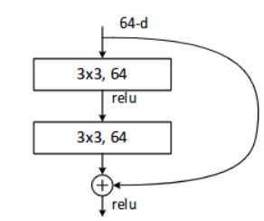
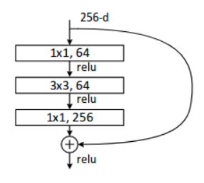
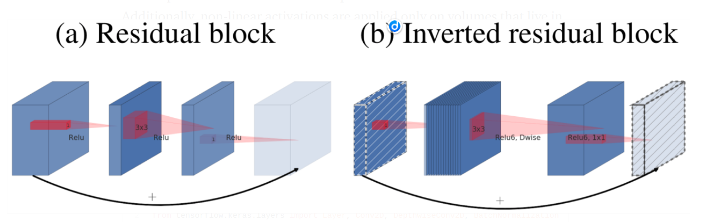
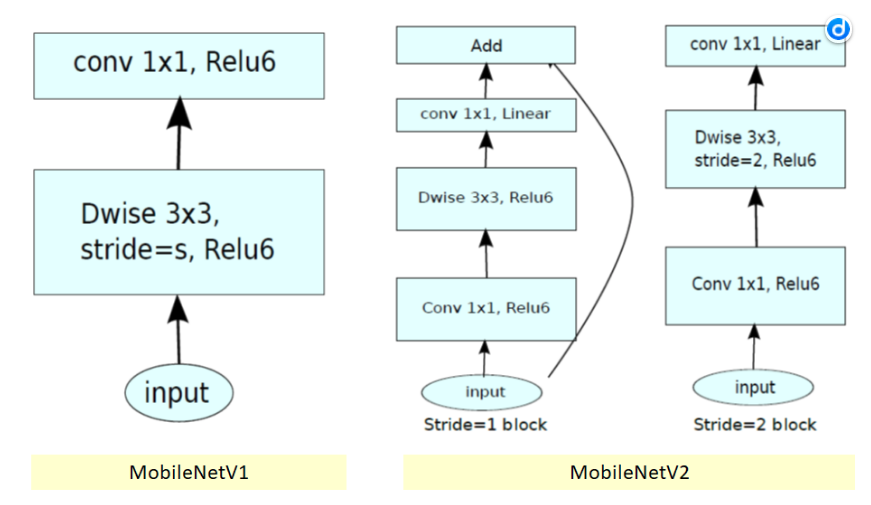
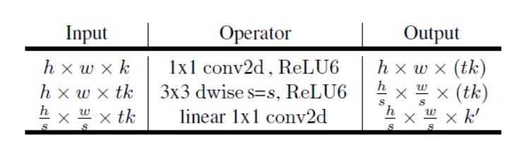

# VGG

Configurations of VGG; depth increases from left to right and the added layers are bolded. The convolutional layer parameters are denoted as “conv<receptive field size> — <number of channels>”.

网络结构简单,每一个conv layer由3x3conv + bn(可选) + relu组成,再不断的stack组成cnn,经典的是VGG-16和VGG-19
kernel size采用3x3,相比之前的5x5, 7x7, 11x11来说参数量和计算量都减少很多, 我们还知道2个3x3conv的cover area和一个5x5conv相当
其中有用到1x1conv,可以用于降低channel,同时参数量小,计算量也小. 还可以增强网络的非线性能力

keras官方代码vgg16采用的是D方案, 此处的keras是指from tensorflow import keras(也可以理解为tf.keras)

vgg16优化方案:
+ 采用TensorRT(暂时是FP32-->FP32, FP-->INT8还需要查查资料,特别是inference的数据格式问题, 转化方面都是走通了的)
+ 采用Tensorflow Lite(转化成功,但是好像默认的是调用CPU,还需要查查资料看看如何使用GPU)
+ 采用pruning

# ResNet

ResNet Architectures

主要还是skip connection,分为identity mapping(dimension一样),projection shortcut(dimension不一样), 用于解决网络层数越多而造成的梯度消失问题. identity mapping就是输入x+output, projection shortcut就是输入self.conv(x)+output

BasicBlock

Bottleneck,输入和输出的channel大,中间的channel小

# MobileNetV2

Comparison between the conventional residual layer and the inverted residual layer

这里的t用于控制model thinner, 其实是控制output channel

# 问题
1. conv2D的output channel  64 128 256 512递增
ouput channel也就是网络的宽width, 在不断的conv过程中, feature map的resolution越来越小(downsample原因), 低层级提取的是edge特征,高层级提取的是语义特征,特征多样性越丰富,有利于提升网络的准确率,比如VGG的最大channel=512, resnet的2048, mobilenet的1024,我们发现resnet的准确率最高,还有个比较形象的解释,物种进化,edge特征相当于祖先,语义特征相当于后代进化过的物种,更具多样性. feature map响应后面的决策结果

2. Maxpooling作downsample和conv2D stride=2的区别
能提升网络的准确率

3. conv2D中的dilation_rate或者说dalation conv
主要用于image segmentation和high resolution image,暂时不考虑

# 工具
网络可视化软件: Netron, 如果可以的话, 最好用Tensorboard,可视化信息更加详细