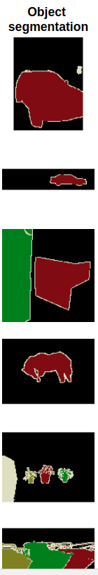
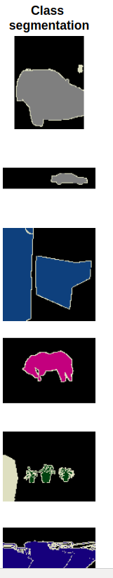
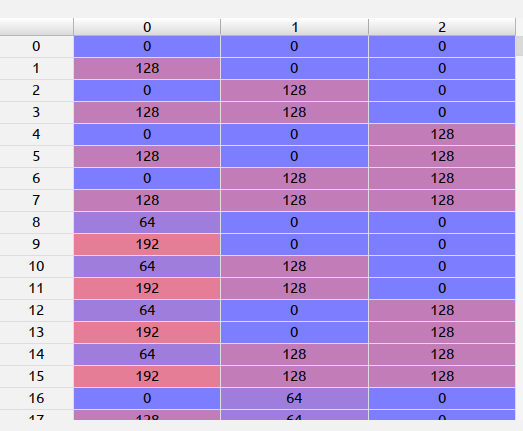
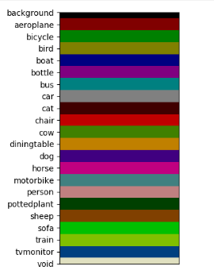
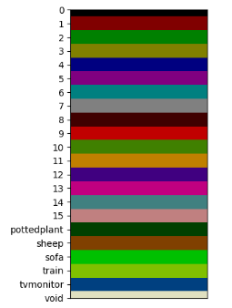
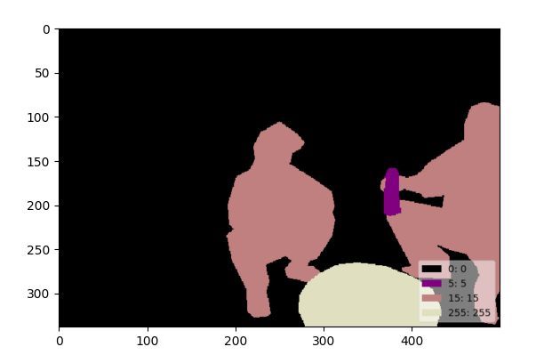

1. 如何标注数据
2. 如何训练算法

#### 一些资料:
1. [图像分割 传统方法 整理](https://zhuanlan.zhihu.com/p/30732385)
2. [图像分割技术介绍](https://zhuanlan.zhihu.com/p/49512872)
3. [图像分割](https://zh.wikipedia.org/wiki/%E5%9B%BE%E5%83%8F%E5%88%86%E5%89%B2)
4. [深度学习图像标注工具汇总](https://blog.csdn.net/chaipp0607/article/details/79036312)
5. [语义分割的图片如何标注](https://www.zhihu.com/question/52835506)
6. [Review of Deep Learning Algorithms for Image Semantic Segmentation](https://medium.com/@arthur_ouaknine/review-of-deep-learning-algorithms-for-image-semantic-segmentation-509a600f7b57)

#### 几个不错的数据集:
1. [Cityscapes](https://www.cityscapes-dataset.com/examples/)
2. [ADE20K](http://groups.csail.mit.edu/vision/datasets/ADE20K/)
3. [PASCAL VOC](http://host.robots.ox.ac.uk/pascal/VOC/voc2012/segexamples/index.html)

#### 图像语义分割(image semantic segmentation)
1. Obejct segmentation

2. Classes segmentation


常用的数据标注格式:
```
1. PASCAL VOC
2. COCO
```

国内的资料可以大概浏览一个领域，国外的资料可以详细浏览一个领域并且有最新的前沿知识

#### 目前，研究者们最为关注的研究方向主要有三个:
1. 语义分割(semantic segmentation)
2. 实例分割(instance segmentation)
```
可以参考下COCO Dataset的这个链接，http://cocodataset.org/#detection-2018
```
3. 全景分割(panoptic segmentation)
```
可以参考下COCO Dataset的这个链接，http://cocodataset.org/#panoptic-2019
```

#### Github上的开源项目:
1. [Awesome Semantic Segmentation](https://github.com/mrgloom/awesome-semantic-segmentation)
2. 数据标注工具的话，我推荐两个吧[COCO-annotator](https://github.com/jsbroks/coco-annotator)，这个工具还是很强大的，有兴趣的话，去搜搜什么叫众包，还有个工具是[labelme](https://github.com/wkentaro/labelme)
3. [Implementation of Segnet, FCN, UNet , PSPNet and other models in Keras](https://github.com/divamgupta/image-segmentation-keras)如果看Github不太明白的话，这里有一篇教程可以看看[A Beginner's guide to Deep Learning based Semantic Segmentation using Keras](https://divamgupta.com/image-segmentation/2019/06/06/deep-learning-semantic-segmentation-keras.html)
```
这个开源库可以马上使用自己的数据集进行semantic segmentation的训练，出来的效果还是不错的
```

这张图的效果看起来比较差，其实换成另外一种算法效果就很不错了，不过我忘了保存，就这样先吧
4. [imgaug](https://github.com/aleju/imgaug)图像增强的开源项目，不过我没用过，看效果还不错
5. [unet for image segmentation](https://github.com/zhixuhao/unet)
6. [DeepLab: Deep Labelling for Semantic Image Segmentation](https://github.com/tensorflow/models/tree/master/research/deeplab)Tensorflow官网的DeepLab还没细看
7. [A python script to convert COCO into Pascal VOC 2012 format](https://github.com/carolinepacheco/Convert-COCO-to-PascalVOC)标注的数据格式转换，可能有用吧
8. [Deep Extreme Cut](https://github.com/scaelles/DEXTR-PyTorch)

#### 医学方面的图像知识:
1. [用于产前诊断的MRI和超声融合成像](https://blog.csdn.net/weixin_41783077/article/details/80895400)
2. [基于深度学习的目标检测算法及其在医学影像中的应用](https://blog.csdn.net/weixin_41783077/article/details/82019494)
3. [医学图像分割方法及卷积神经网络在医学图像分割上的应用](https://blog.csdn.net/weixin_41783077/article/details/82982393)
```
里面提到了阈值法，区域生长法，边缘检测法等，所以课程里的基础传统视觉算法大家好好学习
```
4. [基于全卷积神经网络的前列腺磁共振图像分割](https://blog.csdn.net/weixin_41783077/article/details/82982662)
5. [采用最大连通域算法对三维医学图像分割结果做后处理](https://blog.csdn.net/weixin_41783077/article/details/82990355)
6. [SimpleITK计算dice系数及Hausdorff距离（python代码）](https://blog.csdn.net/weixin_41783077/article/details/82990200)
7. [深度学习网络结构汇总（21种网络结构）](https://blog.csdn.net/weixin_41783077/article/details/83504718)
8. [深度学习图像分类技术最近进展（以皮肤癌图像分类为例）](https://blog.csdn.net/weixin_41783077/article/details/83663089)
9. [基于深度学习的医学图像分割综述](https://blog.csdn.net/weixin_41783077/article/details/80894466)
10. [ISBI Challenge: Segmentation of neuronal structures in EM stacks](http://brainiac2.mit.edu/isbi_challenge/)
11. [Projects](https://www5.cs.fau.de/en/our-team/endres-juergen/projects)
12. [Medical Image Segmentation](https://www5.cs.fau.de/research/groups/medical-image-segmentation/)


#### 论文:
1. [U-Net: Convolutional Networks for Biomedical Image Segmentation](https://arxiv.org/abs/1505.04597)
2. [Deep Extreme Cut: From Extreme Points to Object Segmentation](https://arxiv.org/abs/1711.09081)

#### 疑问查询:
1. [upsampling和transpose convolution](https://stats.stackexchange.com/questions/252810/in-cnn-does-upsampling-and-transpose-convolution-the-same)

#### PASCAL VOC数据标注详解
1. color_map
2. label_name
3. label_id------array_index

```
import numpy as np
from skimage.io import imshow
import matplotlib.pyplot as plt

def color_map(N=256, normalized=False):
    def bitget(byteval, idx):
        return ((byteval & (1 << idx)) != 0)

    dtype = 'float32' if normalized else 'uint8'
    cmap = np.zeros((N, 3), dtype=dtype)
    for i in range(N):
        r = g = b = 0
        c = i
        for j in range(8):
            r = r | (bitget(c, 0) << 7-j)
            g = g | (bitget(c, 1) << 7-j)
            b = b | (bitget(c, 2) << 7-j)
            c = c >> 3

        cmap[i] = np.array([r, g, b])

    cmap = cmap/255 if normalized else cmap
    return cmap


def color_map_viz():
    labels = ['0', '1', '2', '3', '4', '5', '6', '7', '8', '9', '10', '11', '12', '13', '14', '15', 'pottedplant', 'sheep', 'sofa', 'train', 'tvmonitor', 'void']
    nclasses = 21
    row_size = 50
    col_size = 500
    cmap = color_map()
    array = np.empty((row_size*(nclasses+1), col_size, cmap.shape[1]), dtype=cmap.dtype)
    for i in range(nclasses):
        array[i*row_size:i*row_size+row_size, :] = cmap[i]
    array[nclasses*row_size:nclasses*row_size+row_size, :] = cmap[-1]

    imshow(array)
    plt.yticks([row_size*i+row_size/2 for i in range(nclasses+1)], labels)
    plt.xticks([])
    plt.show()

cmap = color_map()
color_map_viz()
```

上图是color_map的结果示意图，对应的0, 1, 2分别为RGB三通道，注意这里的array_index后面要用到


从这张图我们可以看到color_map和label_name的对应关系，当中array_index起到了桥接作用


这张图更明显的解释了color_map和label_name和label_id的转换关系，以及array_index起到的桥接作用


这张图中的array_index也是有启发作用的

下面给出参考链接:
1. https://github.com/wkentaro/labelme/tree/master/examples/semantic_segmentation
2. https://gist.github.com/wllhf/a4533e0adebe57e3ed06d4b50c8419ae

```
#!/usr/bin/env python

from __future__ import print_function

import argparse
import glob
import json
import os
import os.path as osp
import sys

import numpy as np
import PIL.Image

import labelme


def main():
    parser = argparse.ArgumentParser(
        formatter_class=argparse.ArgumentDefaultsHelpFormatter
    )
    parser.add_argument('input_dir', help='input annotated directory')
    parser.add_argument('output_dir', help='output dataset directory')
    parser.add_argument('--labels', help='labels file', required=True)
    args = parser.parse_args()

    if osp.exists(args.output_dir):
        print('Output directory already exists:', args.output_dir)
        sys.exit(1)
    os.makedirs(args.output_dir)
    os.makedirs(osp.join(args.output_dir, 'JPEGImages'))
    os.makedirs(osp.join(args.output_dir, 'SegmentationClass'))
    os.makedirs(osp.join(args.output_dir, 'SegmentationClassPNG'))
    os.makedirs(osp.join(args.output_dir, 'SegmentationClassVisualization'))
    print('Creating dataset:', args.output_dir)

    class_names = []
    class_name_to_id = {}
    for i, line in enumerate(open(args.labels).readlines()):
        class_id = i - 1  # starts with -1
        class_name = line.strip()
        class_name_to_id[class_name] = class_id
        if class_id == -1:
            assert class_name == '__ignore__'
            continue
        elif class_id == 0:
            assert class_name == '_background_'
        class_names.append(class_name)
    class_names = tuple(class_names)
    print('class_names:', class_names)
    out_class_names_file = osp.join(args.output_dir, 'class_names.txt')
    with open(out_class_names_file, 'w') as f:
        f.writelines('\n'.join(class_names))
    print('Saved class_names:', out_class_names_file)

    colormap = labelme.utils.label_colormap(255)

    for label_file in glob.glob(osp.join(args.input_dir, '*.json')):
        print('Generating dataset from:', label_file)
        with open(label_file) as f:
            base = osp.splitext(osp.basename(label_file))[0]
            out_img_file = osp.join(
                args.output_dir, 'JPEGImages', base + '.jpg')
            out_lbl_file = osp.join(
                args.output_dir, 'SegmentationClass', base + '.npy')
            out_png_file = osp.join(
                args.output_dir, 'SegmentationClassPNG', base + '.png')
            out_viz_file = osp.join(
                args.output_dir,
                'SegmentationClassVisualization',
                base + '.jpg',
            )

            data = json.load(f)

            img_file = osp.join(osp.dirname(label_file), data['imagePath'])
            img = np.asarray(PIL.Image.open(img_file))
            PIL.Image.fromarray(img).save(out_img_file)

            lbl = labelme.utils.shapes_to_label(
                img_shape=img.shape,
                shapes=data['shapes'],
                label_name_to_value=class_name_to_id,
            )
            labelme.utils.lblsave(out_png_file, lbl)

            np.save(out_lbl_file, lbl)

            viz = labelme.utils.draw_label(
                lbl, img, class_names, colormap=colormap)
            PIL.Image.fromarray(viz).save(out_viz_file)


if __name__ == '__main__':
    main()
```
注意代码中的class_names和class_name_to_id，以及当中的_ignore_类别的class_id为-1，这个在array_index中代表最后一个元素，background的class_id为0