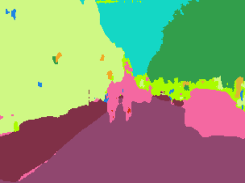

1. 如何标注数据
2. 如何训练算法

#### 一些资料:
1. [图像分割 传统方法 整理](https://zhuanlan.zhihu.com/p/30732385)
2. [图像分割技术介绍](https://zhuanlan.zhihu.com/p/49512872)
3. [图像分割](https://zh.wikipedia.org/wiki/%E5%9B%BE%E5%83%8F%E5%88%86%E5%89%B2)
4. [深度学习图像标注工具汇总](https://blog.csdn.net/chaipp0607/article/details/79036312)
5. [语义分割的图片如何标注](https://www.zhihu.com/question/52835506)
6. [Review of Deep Learning Algorithms for Image Semantic Segmentation](https://medium.com/@arthur_ouaknine/review-of-deep-learning-algorithms-for-image-semantic-segmentation-509a600f7b57)

#### 几个不错的数据集:
1. [Cityscapes](https://www.cityscapes-dataset.com/examples/)
2. [ADE20K](http://groups.csail.mit.edu/vision/datasets/ADE20K/)
3. [PASCAL VOC](http://host.robots.ox.ac.uk/pascal/VOC/voc2012/segexamples/index.html)

#### 图像语义分割(image semantic segmentation)
1. Obejct segmentation

2. Classes segmentation


常用的数据标注格式:
```
1. PASCAL VOC
2. COCO
```

国内的资料可以大概浏览一个领域，国外的资料可以详细浏览一个领域并且有最新的前沿知识

#### 目前，研究者们最为关注的研究方向主要有三个:
1. 语义分割(semantic segmentation)
2. 实例分割(instance segmentation)
```
可以参考下COCO Dataset的这个链接，http://cocodataset.org/#detection-2018
```
3. 全景分割(panoptic segmentation)
```
可以参考下COCO Dataset的这个链接，http://cocodataset.org/#panoptic-2019
```

#### Github上的开源项目:
1. [Awesome Semantic Segmentation](https://github.com/mrgloom/awesome-semantic-segmentation)
2. 数据标注工具的话，我推荐两个吧[COCO-annotator](https://github.com/jsbroks/coco-annotator)，这个工具还是很强大的，有兴趣的话，去搜搜什么叫众包，还有个工具是[labelme](https://github.com/wkentaro/labelme)
3. [Implementation of Segnet, FCN, UNet , PSPNet and other models in Keras](https://github.com/divamgupta/image-segmentation-keras)如果看Github不太明白的话，这里有一篇教程可以看看[A Beginner's guide to Deep Learning based Semantic Segmentation using Keras](https://divamgupta.com/image-segmentation/2019/06/06/deep-learning-semantic-segmentation-keras.html)
```
这个开源库可以马上使用自己的数据集进行semantic segmentation的训练，出来的效果还是不错的
```

这张图的效果看起来比较差，其实换成另外一种算法效果就很不错了，不过我忘了保存，就这样先吧
4. [imgaug](https://github.com/aleju/imgaug)图像增强的开源项目，不过我没用过，看效果还不错
5. [unet for image segmentation](https://github.com/zhixuhao/unet)
6. [DeepLab: Deep Labelling for Semantic Image Segmentation](https://github.com/tensorflow/models/tree/master/research/deeplab)Tensorflow官网的DeepLab还没细看
7. [A python script to convert COCO into Pascal VOC 2012 format](https://github.com/carolinepacheco/Convert-COCO-to-PascalVOC)标注的数据格式转换，可能有用吧
8. [Deep Extreme Cut](https://github.com/scaelles/DEXTR-PyTorch)

#### 医学方面的图像知识:
1. [用于产前诊断的MRI和超声融合成像](https://blog.csdn.net/weixin_41783077/article/details/80895400)
2. [基于深度学习的目标检测算法及其在医学影像中的应用](https://blog.csdn.net/weixin_41783077/article/details/82019494)
3. [医学图像分割方法及卷积神经网络在医学图像分割上的应用](https://blog.csdn.net/weixin_41783077/article/details/82982393)
```
里面提到了阈值法，区域生长法，边缘检测法等，所以课程里的基础传统视觉算法大家好好学习
```
4. [基于全卷积神经网络的前列腺磁共振图像分割](https://blog.csdn.net/weixin_41783077/article/details/82982662)
5. [采用最大连通域算法对三维医学图像分割结果做后处理](https://blog.csdn.net/weixin_41783077/article/details/82990355)
6. [SimpleITK计算dice系数及Hausdorff距离（python代码）](https://blog.csdn.net/weixin_41783077/article/details/82990200)
7. [深度学习网络结构汇总（21种网络结构）](https://blog.csdn.net/weixin_41783077/article/details/83504718)
8. [深度学习图像分类技术最近进展（以皮肤癌图像分类为例）](https://blog.csdn.net/weixin_41783077/article/details/83663089)
9. [基于深度学习的医学图像分割综述](https://blog.csdn.net/weixin_41783077/article/details/80894466)
10. [ISBI Challenge: Segmentation of neuronal structures in EM stacks](http://brainiac2.mit.edu/isbi_challenge/)
11. [Projects](https://www5.cs.fau.de/en/our-team/endres-juergen/projects)
12. [Medical Image Segmentation](https://www5.cs.fau.de/research/groups/medical-image-segmentation/)


#### 论文:
1. [U-Net: Convolutional Networks for Biomedical Image Segmentation](https://arxiv.org/abs/1505.04597)

#### 疑问查询:
1. [upsampling和transpose convolution](https://stats.stackexchange.com/questions/252810/in-cnn-does-upsampling-and-transpose-convolution-the-same)
2. [Deep Extreme Cut: From Extreme Points to Object Segmentation](https://arxiv.org/abs/1711.09081)