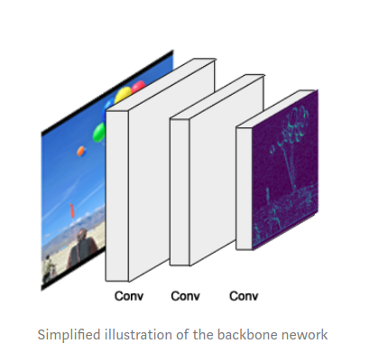
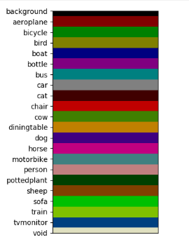
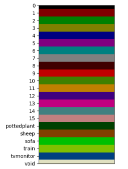
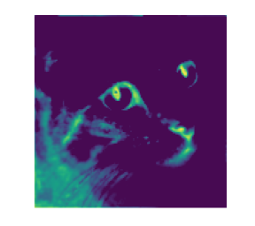

### 对应代码位置
https://gitee.com/maoxianxin19960229/tensorflow_cv

### 图像分割
#### Mask R-CNN
检测+分割的结合我觉得很好

神经网络为什么训练完之后得到的权重可以用于预测，本质上我们可以把神经网络理解为对分布的拟合，比如我们拟合了检测网络中行人的分布，而且有conv对应平移不变性，其中提到的sliding windows我们可以理解为搜索

输入input image，随着不断的conv我们可以得到high level feature，ResNet中存在skip connection，它连接了low level和high level增强了网络中信息的融合和流通(对于信息流通可以这样理解，在进行反向传播时，随着网络加深，会出现梯度消失或者梯度退化等问题，此时增加skip connection，增强了网络中信息的融合和流通，解决了更深层网络性能退化的问题，数学上来讲的话，可以理解为拟合残差，这个还要查下资料)
##### Github上的仓库
1. matterport/Mask_RCNN


https://github.com/matterport/Mask_RCNN

The model generates bounding boxes and segmentation masks for each instance of an object in the image. It's based on the Feature Pyramid Network(FPN) and a ResNet101 backbone


这个图我觉得不错，比较直观的解释了分类，语义分割，物体检测，实例分割

Mask R-CNN(regional convolutional neural network) is a two stage framework: the first stage scans the image and generates proposals(areas likely to contain an object). and the second stage classifies the proposals and generates bounding boxes and masks

输入的input image经过不断的conv得到high level feature(sematic information)，卷积神经网络分为feature extraction模块和classification模块(使用全连接的好处是可以用到global feature，如果使用全卷积的话，可以用到local feature，这个我觉得可以与receptive field联系起来，这对pixel-wise classification来说是有好处的，比如这种架构叫做FCN，但对于分类任务而言，是从一张图片的global角度来看的，所以一般采用全连接)
##### 架构
Faster R-CNN+Mask branch
Object detection+Segmentation


用RoIAlign替代这里的RoIPooling，input image经过卷积后得到feature map，经过RoI Projection得到上图的第二个阶段结果图

1. BackBone

This is a standard convolutional neural network(typically ResNet50 or ResNet101) that serves as a feature extractor. the early layers detect low level features(edges and corners), and later layers successively detect higher level features(car, person, sky)

Passing through the backbone network, the image is converted from 1024x1024x3(RGB) to a feature map of shape 32x32x2048. this feature map becomes the input for the following stages

The backbone is built in the function resnet_graph()

Feature Pyramid Network

While the backbone described above works great, it can be improved upon. the feature pyramid network(FPN) was introduced by the same authors of Mask R-CNN as an extension that can better represent objects at multiple scales

FPN improves the standard feature extraction pyramid by adding a second pyramid that takes the high level features from the first pyramid and passes them down to lower layers. By doing so, it allows features at every level to have access to both, lower and higher level features

Our implementation of Mask RCNN uses a ResNet101+FPN backbone

The FPN is created in MaskRCNN.build(). the section after building the ResNet. FPN introduces additional complexity: rather than a single backbone feature map in the standard backbone(the top layer of the first pyramid), in FPN there is a feature map at each level of the second pyramid. we pick which to use dynamically depending on the size of the object. i'll continue to refer to the backbone feature map as if it's one feature map, but keep in mind that when using FPN, we're actually picking one out of several at runtime

2. Region Proposal Network(RPN)

The RPN is a lightweight neural network that scans the image in a sliding-window fashion and finds areas that contain objects

The regions that the RPN scans over are called anchors. which are boxes distributed over the image area, as show on the left. this is a simplified view. in practice, there are abount 200K anchors of different sizes and aspect ratios, and they overlap to cover as much of the image as possible

How fast can the RPN scan that many anchors? Pretty fast. the sliding window is handled by the convolutional nature of the RPN, which allows it to scan all regions in parallel(on a GPU). Further, the RPN doesn't scan over the image directly(even though we draw the anchors on the image for illustration). instead, the RPN scans over the backbone feature map. this allows the RPN to reuse the extracted features efficiently and avoid duplicate calculations

The RPN is created in rpn_graph(). Anchor scales and aspect ratios


The RPN generates two outputs for each anchor:
Anchor Classes: One of two classes: foreground or background. the FG class implies that there is likely an object in that box
Bounding Box Refinement: A foreground anchor(also called positive anchor) might not be centered perfectly over the object. so the RPN estimates a  delta(% chande in x,y,width,height) to refine the anchor box to fit the object better

Using the RPN predictions, we pick the top anchors that are likely to contain objects and refine their location and size. if several anchors overlap too much, we keep the one with the highest foreground score and discard the rest(referred to as Non-Max Suppression). after that we have the final proposals(regions of interest) that we pass to the next stage

The ProposalLayer is a custom Keras layer that reads the output of the RPN, picks top anchors, and applies bounding box refinement

3. ROI Classifer & Bounding Box Regressor
This stage runs on the regions of interest(ROIs) proposed by the RPN

Class: the class of the object in the ROI. unlike the RPN, which has two classes(FG/BG), this network is deeper and has the capacity to classify regions to specfic classes(person, car, chair). it can also generate a background class, which causes the ROI to be discarded
Bounding Box Refinement: very similar to how it's done in the RPN, and its purpose is to further refine the location and size of the bounding box to encapsulate the object

The classifier and bounding box regressor are created in fpn_classifier_graph()

ROI Pooling

Classifiers don't handle variable input size very well. they typically require a fixed input size(因为全连接网络的原因). ROI pooling refers to cropping a part of a feature map and resizing it to a fixed size.

The authors of Mask R-CNN suggest a method they named ROIAlign, in which they sample the feature map at different points and apply a bilinear interpolation. in our implementation, we used tensorflow's crop_and_resize function for simplicity and because it's close enough for most purposes

ROI pooling is implemented in the class PyramidROIAlign

4. Segmentation Masks


COCO dataset does not contain a balloon class, it contains a lot of other images(~120K), so the trained weights have already learned a lot of the features common in natural images, which really helps(feature extraction具有通用性)

bounding boxes are generated dynamically from the masks

Don't convert your dataset to a format similar to COCO or the VIA format. Instead, write your own Dataset class to load whichever format your dataset comes in. See the samples and notice how each uses its own Dataset class

Q: I want to dive deeper and understant the details, what should i read?
A: read these papers in this order: RCNN, Fast RCNN, Faster RCNN, FPN, Mask RCNN

##### 参考文章
1. [Keras Mask R-CNN](https://www.pyimagesearch.com/2019/06/10/keras-mask-r-cnn/)用于预测的
2. [Splash of Color: Instance Segmentation with Mask R-CNN and TensorFlow](https://engineering.matterport.com/splash-of-color-instance-segmentation-with-mask-r-cnn-and-tensorflow-7c761e238b46)解释了Mask R-CNN网络架构，标注数据集，训练网络和评估

#### 一些资料:
1. [图像分割 传统方法 整理](https://zhuanlan.zhihu.com/p/30732385)
2. [图像分割技术介绍](https://zhuanlan.zhihu.com/p/49512872)
3. [图像分割](https://zh.wikipedia.org/wiki/%E5%9B%BE%E5%83%8F%E5%88%86%E5%89%B2)
4. [深度学习图像标注工具汇总](https://blog.csdn.net/chaipp0607/article/details/79036312)
5. [语义分割的图片如何标注](https://www.zhihu.com/question/52835506)
6. [Review of Deep Learning Algorithms for Image Semantic Segmentation](https://medium.com/@arthur_ouaknine/review-of-deep-learning-algorithms-for-image-semantic-segmentation-509a600f7b57)

#### 几个不错的数据集:
1. [Cityscapes](https://www.cityscapes-dataset.com/examples/)
2. [ADE20K](http://groups.csail.mit.edu/vision/datasets/ADE20K/)
3. [PASCAL VOC](http://host.robots.ox.ac.uk/pascal/VOC/voc2012/segexamples/index.html)

#### 图像语义分割(image semantic segmentation)
1. Obejct segmentation

2. Classes segmentation


常用的数据标注格式:
```
1. PASCAL VOC
2. COCO
```

国内的资料可以大概浏览一个领域，国外的资料可以详细浏览一个领域并且有最新的前沿知识

#### 目前，研究者们最为关注的研究方向主要有三个:
1. 语义分割(semantic segmentation)
2. 实例分割(instance segmentation)
```
可以参考下COCO Dataset的这个链接，http://cocodataset.org/#detection-2018
```
3. 全景分割(panoptic segmentation)
```
可以参考下COCO Dataset的这个链接，http://cocodataset.org/#panoptic-2019
```

#### Github上的开源项目:
1. [Awesome Semantic Segmentation](https://github.com/mrgloom/awesome-semantic-segmentation)
2. 数据标注工具的话，我推荐两个吧[COCO-annotator](https://github.com/jsbroks/coco-annotator)，这个工具还是很强大的，有兴趣的话，去搜搜什么叫众包，还有个工具是[labelme](https://github.com/wkentaro/labelme)
3. [Implementation of Segnet, FCN, UNet , PSPNet and other models in Keras](https://github.com/divamgupta/image-segmentation-keras)如果看Github不太明白的话，这里有一篇教程可以看看[A Beginner's guide to Deep Learning based Semantic Segmentation using Keras](https://divamgupta.com/image-segmentation/2019/06/06/deep-learning-semantic-segmentation-keras.html)
```
这个开源库可以马上使用自己的数据集进行semantic segmentation的训练，出来的效果还是不错的
```

4. [imgaug](https://github.com/aleju/imgaug)图像增强的开源项目，不过我没用过，看效果还不错
5. [unet for image segmentation](https://github.com/zhixuhao/unet)
6. [DeepLab: Deep Labelling for Semantic Image Segmentation](https://github.com/tensorflow/models/tree/master/research/deeplab)Tensorflow官网的DeepLab还没细看
7. [A python script to convert COCO into Pascal VOC 2012 format](https://github.com/carolinepacheco/Convert-COCO-to-PascalVOC)标注的数据格式转换，可能有用吧
8. [Deep Extreme Cut](https://github.com/scaelles/DEXTR-PyTorch)

#### 医学方面的图像知识:
1. [用于产前诊断的MRI和超声融合成像](https://blog.csdn.net/weixin_41783077/article/details/80895400)
2. [基于深度学习的目标检测算法及其在医学影像中的应用](https://blog.csdn.net/weixin_41783077/article/details/82019494)
3. [医学图像分割方法及卷积神经网络在医学图像分割上的应用](https://blog.csdn.net/weixin_41783077/article/details/82982393)
```
里面提到了阈值法，区域生长法，边缘检测法等，所以课程里的基础传统视觉算法大家好好学习
```
4. [基于全卷积神经网络的前列腺磁共振图像分割](https://blog.csdn.net/weixin_41783077/article/details/82982662)
5. [采用最大连通域算法对三维医学图像分割结果做后处理](https://blog.csdn.net/weixin_41783077/article/details/82990355)
6. [SimpleITK计算dice系数及Hausdorff距离（python代码）](https://blog.csdn.net/weixin_41783077/article/details/82990200)
7. [深度学习网络结构汇总（21种网络结构）](https://blog.csdn.net/weixin_41783077/article/details/83504718)
8. [深度学习图像分类技术最近进展（以皮肤癌图像分类为例）](https://blog.csdn.net/weixin_41783077/article/details/83663089)
9. [基于深度学习的医学图像分割综述](https://blog.csdn.net/weixin_41783077/article/details/80894466)
10. [ISBI Challenge: Segmentation of neuronal structures in EM stacks](http://brainiac2.mit.edu/isbi_challenge/)
11. [Projects](https://www5.cs.fau.de/en/our-team/endres-juergen/projects)
12. [Medical Image Segmentation](https://www5.cs.fau.de/research/groups/medical-image-segmentation/)


#### 论文:
1. [U-Net: Convolutional Networks for Biomedical Image Segmentation](https://arxiv.org/abs/1505.04597)
2. [Deep Extreme Cut: From Extreme Points to Object Segmentation](https://arxiv.org/abs/1711.09081)

#### 疑问查询:
1. [upsampling和transpose convolution](https://stats.stackexchange.com/questions/252810/in-cnn-does-upsampling-and-transpose-convolution-the-same)

#### PASCAL VOC数据标注详解
1. color_map
2. label_name
3. label_id------array_index

```
import numpy as np
from skimage.io import imshow
import matplotlib.pyplot as plt

def color_map(N=256, normalized=False):
    def bitget(byteval, idx):
        return ((byteval & (1 << idx)) != 0)

    dtype = 'float32' if normalized else 'uint8'
    cmap = np.zeros((N, 3), dtype=dtype)
    for i in range(N):
        r = g = b = 0
        c = i
        for j in range(8):
            r = r | (bitget(c, 0) << 7-j)
            g = g | (bitget(c, 1) << 7-j)
            b = b | (bitget(c, 2) << 7-j)
            c = c >> 3

        cmap[i] = np.array([r, g, b])

    cmap = cmap/255 if normalized else cmap
    return cmap


def color_map_viz():
    labels = ['0', '1', '2', '3', '4', '5', '6', '7', '8', '9', '10', '11', '12', '13', '14', '15', 'pottedplant', 'sheep', 'sofa', 'train', 'tvmonitor', 'void']
    nclasses = 21
    row_size = 50
    col_size = 500
    cmap = color_map()
    array = np.empty((row_size*(nclasses+1), col_size, cmap.shape[1]), dtype=cmap.dtype)
    for i in range(nclasses):
        array[i*row_size:i*row_size+row_size, :] = cmap[i]
    array[nclasses*row_size:nclasses*row_size+row_size, :] = cmap[-1]

    imshow(array)
    plt.yticks([row_size*i+row_size/2 for i in range(nclasses+1)], labels)
    plt.xticks([])
    plt.show()

cmap = color_map()
color_map_viz()
```

上图是color_map的结果示意图，对应的0, 1, 2分别为RGB三通道，注意这里的array_index后面要用到


从这张图我们可以看到color_map和label_name的对应关系，当中array_index起到了桥接作用


这张图更明显的解释了color_map和label_name和label_id的转换关系，以及array_index起到的桥接作用


这张图中的array_index也是有启发作用的

下面给出参考链接:
1. https://github.com/wkentaro/labelme/tree/master/examples/semantic_segmentation
2. https://gist.github.com/wllhf/a4533e0adebe57e3ed06d4b50c8419ae

```
#!/usr/bin/env python

from __future__ import print_function

import argparse
import glob
import json
import os
import os.path as osp
import sys

import numpy as np
import PIL.Image

import labelme


def main():
    parser = argparse.ArgumentParser(
        formatter_class=argparse.ArgumentDefaultsHelpFormatter
    )
    parser.add_argument('input_dir', help='input annotated directory')
    parser.add_argument('output_dir', help='output dataset directory')
    parser.add_argument('--labels', help='labels file', required=True)
    args = parser.parse_args()

    if osp.exists(args.output_dir):
        print('Output directory already exists:', args.output_dir)
        sys.exit(1)
    os.makedirs(args.output_dir)
    os.makedirs(osp.join(args.output_dir, 'JPEGImages'))
    os.makedirs(osp.join(args.output_dir, 'SegmentationClass'))
    os.makedirs(osp.join(args.output_dir, 'SegmentationClassPNG'))
    os.makedirs(osp.join(args.output_dir, 'SegmentationClassVisualization'))
    print('Creating dataset:', args.output_dir)

    class_names = []
    class_name_to_id = {}
    for i, line in enumerate(open(args.labels).readlines()):
        class_id = i - 1  # starts with -1
        class_name = line.strip()
        class_name_to_id[class_name] = class_id
        if class_id == -1:
            assert class_name == '__ignore__'
            continue
        elif class_id == 0:
            assert class_name == '_background_'
        class_names.append(class_name)
    class_names = tuple(class_names)
    print('class_names:', class_names)
    out_class_names_file = osp.join(args.output_dir, 'class_names.txt')
    with open(out_class_names_file, 'w') as f:
        f.writelines('\n'.join(class_names))
    print('Saved class_names:', out_class_names_file)

    colormap = labelme.utils.label_colormap(255)

    for label_file in glob.glob(osp.join(args.input_dir, '*.json')):
        print('Generating dataset from:', label_file)
        with open(label_file) as f:
            base = osp.splitext(osp.basename(label_file))[0]
            out_img_file = osp.join(
                args.output_dir, 'JPEGImages', base + '.jpg')
            out_lbl_file = osp.join(
                args.output_dir, 'SegmentationClass', base + '.npy')
            out_png_file = osp.join(
                args.output_dir, 'SegmentationClassPNG', base + '.png')
            out_viz_file = osp.join(
                args.output_dir,
                'SegmentationClassVisualization',
                base + '.jpg',
            )

            data = json.load(f)

            img_file = osp.join(osp.dirname(label_file), data['imagePath'])
            img = np.asarray(PIL.Image.open(img_file))
            PIL.Image.fromarray(img).save(out_img_file)

            lbl = labelme.utils.shapes_to_label(
                img_shape=img.shape,
                shapes=data['shapes'],
                label_name_to_value=class_name_to_id,
            )
            labelme.utils.lblsave(out_png_file, lbl)

            np.save(out_lbl_file, lbl)

            viz = labelme.utils.draw_label(
                lbl, img, class_names, colormap=colormap)
            PIL.Image.fromarray(viz).save(out_viz_file)


if __name__ == '__main__':
    main()
```
注意代码中的class_names和class_name_to_id，以及当中的_ignore_类别的class_id为-1，这个在array_index中代表最后一个元素，background的class_id为0

### 分类
#### ResNet
先研究这个

#### 二分类
主文章[Building Neural Network using Keras for Classification](https://medium.com/datadriveninvestor/building-neural-network-using-keras-for-classification-3a3656c726c1)

数据的样子:

建立input features和target的关系，可以使用神经网络的方法
表格类型的数据可以通过pandas来读取

Prerequisites:
1. [Neural Network Simplified](https://medium.com/datadriveninvestor/neural-network-simplified-c28b6614add4)
2. [Neural Network -Activation functions](https://medium.com/datadriveninvestor/neural-networks-activation-functions-e371202b56ff)
3. [Machine learning Gradient Descent](https://medium.com/datadriveninvestor/gradient-descent-5a13f385d403)
4. [How to evaluate the performance of a machine learning model](https://medium.com/datadriveninvestor/how-to-evaluate-the-performance-of-a-machine-learning-model-45063a7a38a7)

使用的框架是keras
1. Sequential and Functional，存在两种API的搭建模型方式，具体看notebooks/mnist_keras.ipynb
2. Keras can be used as a deep learning library. Support Convolutional and Recurrent Neural Networks
3. Prototyping with keras is fast and easy

二分类的例子:
数据集来这里下载[Pima Indians diabetes](https://raw.githubusercontent.com/jbrownlee/Datasets/master/pima-indians-diabetes.data.csv)
相关代码在notebooks/binary_cls.ipynb里

#### mnist图像分类
主文章[Introduction to Deep Learning with Keras](https://towardsdatascience.com/introduction-to-deep-learning-with-keras-17c09e4f0eb2)
建立input images和target的关系，可以使用卷积神经网络的方法
图像类型的数据可以通过keras内建的函数来读取

#### 训练自己的数据集
参考这篇[Building powerful image classification models using very little data](https://blog.keras.io/building-powerful-image-classification-models-using-very-little-data.html)
代码是cls_own_imgs_*.py

#### 迁移学习
1. [A Gentle Introduction to Transfer Learning for Deep Learning](https://machinelearningmastery.com/transfer-learning-for-deep-learning/)
2. [How to Reuse Models for Computer Vision with Transfer Learning in Keras](https://machinelearningmastery.com/how-to-use-transfer-learning-when-developing-convolutional-neural-network-models/)代码看notebooks/transfer_learning_keras.ipynb

### 目标检测
先研究Faster R-CNN


### 卷积神经网络
1. [Applied Deep Learning - Part 4: Convolutional Neural Networks](https://towardsdatascience.com/applied-deep-learning-part-4-convolutional-neural-networks-584bc134c1e2)

binary classification可以用sigmoid
multiclass classfication可以用softmax


The code for this article is available [here](https://github.com/ardendertat/Applied-Deep-Learning-with-Keras/blob/master/notebooks/Part%204%20(GPU)%20-%20Convolutional%20Neural%20Networks.ipynb) as a Jupyter notebook, feel free to download and try it out yourself

It is also successfully applied to recommender systems, natural language processing and more

The main advantage of CNN compared to its predecessors is that it automatically detects the important features without any human supervision. For example, given many pictures of cats and dogs it learns distinctive features for each class by itself(得益于end-to-end训练，梯度优化算法。low level feature的边缘特征，high level feature的object)

CNN is also computationally efficient. It uses special convolution and pooling operations and performs parameter sharing(矩阵运算可以放到GPU上进行加速，parameter sharing可以理解为sliding进行卷积运算，有减少参数量的作用)


At every location, we do element-wise matrix multiplication and sum the result. This sum goes into the feature map. The green area where the convolution operation takes place is called the receptive field


We perform multiple convolutions on an input, each using a different filter and resulting in a distinct feature map. We then stack all these feature maps together and that becomes the final output of the convolution layer

After a convolution operation we usually perform pooling to reduce the dimensionality. This enables us to reduce the number of parameters, which both shortens the training time and combats overfitting. Pooling layers downsample each feature map independently, reducing the height and width, keeping the depth intact(貌似有人说这个operation不好，后续还要查资料)

There are also 1x1 filters which we will explore in another article, at first sight it might look strange but they have interesting applications(有时候用于减少channels吧)

The first layers detect edges, the next layers combine them to detect shapes, to following layers merge this information to infer that this is a nose. To be clear, the CNN doesn’t know what a nose is. By seeing a lot of them in images, it learns to detect that as a feature. The fully connected layers learn how to use these features produced by convolutions in order to correctly classify the images

Dropout is by far the most popular regularization technique
regularization technique called batch normalization and we will cover it in another article

The reason is that dropout prevents the network to be too dependent on a small number of neurons, and forces every neuron to be able to operate independently. in order to learn more intelligent representations

Dropout can be applied to input or hidden layer nodes but not the output nodes. Also we don’t apply dropout during test time after the network is trained, we do so only in training

A real-life analogy to dropout would be as follows: let’s say you were the only person at your company who knows about finance. If you were guaranteed to be at work every day, your coworkers wouldn’t have an incentive to pick up finance skills. But if every morning you tossed a coin to decide whether you will go to work or not, then your coworkers will need to adapt. Some days you might not be at work but finance tasks still need to get done, so they can’t rely only at you. Your coworkers will need to learn about finance and this expertise needs to be spread out between various people. The workers need to cooperate with several other employees, not with a fixed set of people. This makes the company much more resilient overall, increasing the quality and skillset of the employees(dropout可以防止某些神经元之间产生严重的依赖)

Usually we need at least 100K training examples to start thinking about deep learning(现在并不需要这么多数据了，考虑下迁移学习或者说少样本学习，数据增强也很重要)

Overfitting happens because of having too few examples to train on, resulting in a model that has poor generalization performance. If we had infinite training data, we wouldn’t overfit because we would see every possible instance.

There are some data cleaning tricks that we typically use on images, mainly whitening and mean normalization. More information about them is available [here](http://ufldl.stanford.edu/tutorial/unsupervised/PCAWhitening/)

we made the model transformation invariant, meaning the model saw a lot of shifted/rotated/scaled images so it’s able to recognize them better.

Another advantage of stacking two convolutions instead of one is that we use two relu operations, and more non-linearity gives more power to the model

We will visualize 3 most crucial components of the VGG model: Feature maps, Convnet filters, Class output


Bright areas are the “activated” regions, meaning the filter detected the pattern it was looking for. This filter seems to encode an eye and nose detector


The first layer feature maps (block1_conv1) retain most of the information present in the image. In CNN architectures the first layers usually act as edge detectors

As we go deeper into the network, the feature maps look less like the original image and more like an abstract representation of it. As you can see in block3_conv1 the cat is somewhat visible, but after that it becomes unrecognizable. The reason is that deeper feature maps encode high level concepts like “cat nose” or “dog ear” while lower level feature maps detect simple edges and shapes. That’s why deeper feature maps contain less information about the image and more about the class of the image. They still encode useful features, but they are less visually interpretable by us(low levell feature(edge, shape), high level feature(semantic information))

The feature maps become sparser as we go deeper, meaning the filters detect less features. It makes sense because the filters in the first layers detect simple shapes, and every image contains those. But as we go deeper we start looking for more complex stuff like “dog tail” and they don’t appear in every image. That’s why in the first figure with 8 filters per layer, we see more of the feature maps as blank as we go deeper (block4_conv1 and block5_conv1)


These observations are similar to what we discussed in the feature map section. Lower layers encode/detect simple structures, as we go deeper the layers build on top of each other and learn to encode more complex patterns. This is how we humans start discovering the world as babies too. First we learn simple structures and with practice we excel at understanding more complicated things, building on top of our existing knowledge


All these visualizations were performed using the library [keras-vis](https://raghakot.github.io/keras-vis/)

### Tensorflow


### Keras
#### Keras: A quick overview
[Keras: A quick overview](https://www.tensorflow.org/beta/guide/keras/overview)
This is a high-level API to build and train models that includes first-class support for TensorFlow-specific functionality, such as eager execution, [tf.data pipelines](https://www.tensorflow.org/versions/r2.0/api_docs/python/tf/data), and Estimators
When saving a model's weights, tf.keras defaults to the checkpoint format. Pass save_format='h5' to use HDF5 (or pass a filename that ends in .h5)

[tf.keras.layers](https://www.tensorflow.org/versions/r2.0/api_docs/python/tf/keras/layers)

[tf.keras.Model.compile](https://www.tensorflow.org/versions/r2.0/api_docs/python/tf/keras/Model#compile)
[tf.keras.optimizers](https://www.tensorflow.org/versions/r2.0/api_docs/python/tf/keras/optimizers)
[tf.keras.losses](https://www.tensorflow.org/versions/r2.0/api_docs/python/tf/keras/losses)
[tf.keras.metrics](https://www.tensorflow.org/versions/r2.0/api_docs/python/tf/keras/metrics)

Be aware that the last batch may be smaller if the total number of samples is not divisible by the batch size
validation_data: a tuple of inputs and labels—allows the model to display the loss and metrics in inference mode for the passed data, at the end of each epoch
Use the [Datasets API](https://www.tensorflow.org/beta/guide/data) to scale to large datasets or multi-device training. Pass a [tf.data.Dataset](https://www.tensorflow.org/versions/r2.0/api_docs/python/tf/data/Dataset) instance to the fit method


[Model subclassing](https://www.tensorflow.org/beta/guide/keras/overview#model_subclassing)
Build a fully-customizable model by subclassing tf.keras.Model and defining your own forward pass. Create layers in the __init__ method and set them as attributes of the class instance. Define the forward pass in the call method.

```
class MyModel(tf.keras.Model):

  def __init__(self, num_classes=10):
    super(MyModel, self).__init__(name='my_model')
    self.num_classes = num_classes
    # Define your layers here.
    self.dense_1 = layers.Dense(32, activation='relu')
    self.dense_2 = layers.Dense(num_classes, activation='sigmoid')

  def call(self, inputs):
    # Define your forward pass here,
    # using layers you previously defined (in `__init__`).
    x = self.dense_1(inputs)
    return self.dense_2(x)
```


[tf.keras.callbacks.Callback](https://www.tensorflow.org/versions/r2.0/api_docs/python/tf/keras/callbacks)

A model's configuration can be saved—this serializes the model architecture without any weights. A saved configuration can recreate and initialize the same model, even without the code that defined the original model. Keras supports JSON and YAML serialization formats

Caution: Subclassed models are not serializable because their architecture is defined by the Python code in the body of the call method.

The entire model can be saved to a file that contains the weight values, the model's configuration, and even the optimizer's configuration. This allows you to checkpoint a model and resume training later—from the exact same state—without access to the original code.
```
# Create a simple model
model = tf.keras.Sequential([
  layers.Dense(10, activation='relu', input_shape=(32,)),
  layers.Dense(10, activation='softmax')
])
model.compile(optimizer='rmsprop',
              loss='categorical_crossentropy',
              metrics=['accuracy'])
model.fit(data, labels, batch_size=32, epochs=5)


# Save entire model to a HDF5 file
model.save('my_model.h5')

# Recreate the exact same model, including weights and optimizer.
model = tf.keras.models.load_model('my_model.h5')
```

Currently, [tf.distribute.MirroredStrategy](https://www.tensorflow.org/versions/r2.0/api_docs/python/tf/distribute/MirroredStrategy) is the only supported distribution strategy. MirroredStrategy does in-graph replication with synchronous training using all-reduce on a single machine. To use distribute.Strategys , nest the optimizer instantiation and model construction and compilation in a Strategy's .scope(), then train the model

#### The Keras Functional API in Tensorflow
[The Keras Functional API in TensorFlow](https://www.tensorflow.org/beta/guide/keras/functional)

It's based on the idea that a deep learning model is usually a directed acyclic graph (DAG) of layers. The Functional API a set of tools for building graphs of layers

Note that the batch size is always omitted, we only specify the shape of each sample

The "layer call" action is like drawing an arrow from "inputs" to this layer we created


Here we load MNIST image data, reshape it into vectors, fit the model on the data (while monitoring performance on a validation split), and finally we evaluate our model on the test data
```
history = model.fit(x_train, y_train,
                    batch_size=64,
                    epochs=5,
                    validation_split=0.2)
```

To standard way to save a Functional model is to call model.save() to save the whole model into a single file. You can later recreate the same model from this file, even if you no longer have access to the code that created the model.

This file includes: - The model's architecture - The model's weight values (which were learned during training) - The model's training config (what you passed to compile), if any - The optimizer and its state, if any (this enables you to restart training where you left off)
```
model.save('path_to_my_model.h5')
del model
# Recreate the exact same model purely from the file:
model = keras.models.load_model('path_to_my_model.h5')
```

we use the same stack of layers to instantiate two models: an encoder model that turns image inputs into 16-dimensional vectors, and an end-to-end autoencoder model for training

creates an encoder model, a decoder model, and chain them in two calls to obtain the autoencoder model

The reverse of a Conv2D layer is a Conv2DTranspose layer, and the reverse of a MaxPooling2D layer is an UpSampling2D layer

As you can see, model can be nested: a model can contain submodels (since a model is just like a layer).

A common use case for model nesting is ensembling. As an example, here's how to ensemble a set of models into a single model that averages their predictions
```
def get_model():
  inputs = keras.Input(shape=(128,))
  outputs = layers.Dense(1, activation='sigmoid')(inputs)
  return keras.Model(inputs, outputs)

model1 = get_model()
model2 = get_model()
model3 = get_model()

inputs = keras.Input(shape=(128,))
y1 = model1(inputs)
y2 = model2(inputs)
y3 = model3(inputs)
outputs = layers.average([y1, y2, y3])
ensemble_model = keras.Model(inputs=inputs, outputs=outputs)
```

Shared layers are layer instances that get reused multiple times in a same model: they learn features that correspond to multiple paths in the graph-of-layers

Shared layers are often used to encode inputs that come from similar spaces (say, two different pieces of text that feature similar vocabulary), since they enable sharing of information across these different inputs, and they make it possible to train such a model on less data

these are the intermediate activations of the model, obtained by querying the graph datastructure:
```
features_list = [layer.output for layer in vgg19.layers]

feat_extraction_model = keras.Model(inputs=vgg19.input, outputs=features_list)

img = np.random.random((1, 224, 224, 3)).astype('float32')
extracted_features = feat_extraction_model(img)
```
This comes in handy when [implementing neural style transfer](https://medium.com/tensorflow/neural-style-transfer-creating-art-with-deep-learning-using-tf-keras-and-eager-execution-7d541ac31398), among other things.

All layers subclass the Layer class and implement: - A call method, that specifies the computation done by the layer. - A build method, that creates the weights of the layer (note that this is just a style convention; you could create weights in __init__ as well).

If you want your custom layer to support serialization, you should also define a get_config method, that returns the constructor arguments of the layer instance:

To dive more in-depth into the differences between the Functional API and Model subclassing, you can read [What are Symbolic and Imperative APIs in TensorFlow 2.0](https://medium.com/tensorflow/what-are-symbolic-and-imperative-apis-in-tensorflow-2-0-dfccecb01021)?

[tf.keras.preprocessing.image](https://www.tensorflow.org/versions/r2.0/api_docs/python/tf/keras/preprocessing/image)
[applications](https://www.tensorflow.org/versions/r2.0/api_docs/python/tf/keras/applications) module: Keras Applications are canned architectures with pre-trained weights
[callbacks](https://www.tensorflow.org/versions/r2.0/api_docs/python/tf/keras/callbacks) module: Callbacks: utilities called at certain points during model training
[preprocessing](https://www.tensorflow.org/versions/r2.0/api_docs/python/tf/keras/preprocessing) module: Keras data preprocessing utils

看看keras的模型保存

数据输入(data pipeline)+data augmentation
模型搭建(model build)
训练(training)+callbacks
评估(evaluation)

#### 待解决问题
```
# package import
import tensorflow as tf
from tensorflow import keras

# dataset load, (img, label), label is an integer
(x_train, y_train), (x_test, y_test) = keras.datasets.mnist.load_data()
# scale pixle value to [0,1], dtype is float
x_train, x_test = x_train / 255.0, x_test / 255.0

# model build
# model = keras.Sequential()
# model.add(keras.layers.Flatten())
# model.add(keras.layers.Dense(64, activation='relu'))
# model.add(keras.layers.Dense(64, activation='relu'))
# model.add(keras.layers.Dense(10, activation='softmax'))

inputs = keras.layers.Input(shape=(28,28), name='img')
x = keras.layers.Flatten()(inputs)
x = keras.layers.Dense(64, activation='relu')(x)
x = keras.layers.Dense(64, activation='relu')(x)
outputs = keras.layers.Dense(10, activation='softmax')(x)

model = keras.Model(inputs, outputs)

# model compile
model.compile(optimizer=keras.optimizers.Adam(),
              # loss=keras.losses.sparse_categorical_crossentropy(y_train, model.output),  # 待解决
              loss='sparse_categorical_crossentropy',
              metrics=['accuracy']
              )
# model train
model.fit(x_train, y_train, batch_size=32, epochs=5, validation_split=0.2)
# model evaluation
model.evaluate(x_test, y_test, batch_size=32)
```

```
# custom layer
class MyLayer(layers.Layer):

  def __init__(self, output_dim, **kwargs):
    self.output_dim = output_dim
    super(MyLayer, self).__init__(**kwargs)

  def build(self, input_shape):
    # Create a trainable weight variable for this layer.
    self.kernel = self.add_weight(name='kernel',
                                  shape=(input_shape[1], self.output_dim),
                                  initializer='uniform',
                                  trainable=True)

  def call(self, inputs):
    return tf.matmul(inputs, self.kernel)
  # 用于serialize, 加进output_dim的作用待确定，个人猜测它的作用也就是多记录一下Layer的信息，不是必要的
  def get_config(self):
    base_config = super(MyLayer, self).get_config()
    base_config['output_dim'] = self.output_dim
    return base_config

  @classmethod
  def from_config(cls, config):
    return cls(**config)
```

custom layer如何serialize

#### Neural Style Transfer
[Neural Style Transfer: Creating Art with Deep Learning using tf.keras and eager execution](https://medium.com/tensorflow/neural-style-transfer-creating-art-with-deep-learning-using-tf-keras-and-eager-execution-7d541ac31398)
[A Neural Algorithm of Artistic Style](https://arxiv.org/abs/1508.06576)

Neural style transfer is an optimization technique used to take three images, a content image, a style reference image (such as an artwork by a famous painter), and the input image you want to style — and blend them together such that the input image is transformed to look like the content image, but “painted” in the style of the style image


Is this magic or just deep learning? Fortunately, this doesn’t involve any magic: style transfer is a fun and interesting technique that showcases the capabilities and internal representations of neural networks

The principle of neural style transfer is to define two distance functions, one that describes how different the content of two images are, Lcontent, and one that describes the difference between the two images in terms of their style, Lstyle. Then, given three images, a desired style image, a desired content image, and the input image (initialized with the content image), we try to transform the input image to minimize the content distance with the content image and its style distance with the style image.

We’ll transform the base input image by minimizing the content and style distances (losses) with backpropagation, creating an image that matches the content of the content image and the style of the style image.(对输入的input image进行transform，达到minimize content_loss和style_loss的目的，backpropagation的时候update的只有input image，这一点确实和往常的update weights不一样，思路很好，但终归还是end-to-end的思路)

In order to get both the content and style representations of our image, we will look at some intermediate layers within our model. Intermediate layers represent feature maps that become increasingly higher ordered as you go deeper

These intermediate layers are necessary to define the representation of content and style from our images. For an input image, we will try to match the corresponding style and content target representations at these intermediate layers

At a high level, this phenomenon can be explained by the fact that in order for a network to perform image classification (which our network has been trained to do), it must understand the image. This involves taking the raw image as input pixels and building an internal representation through transformations that turn the raw image pixels into a complex understanding of the features present within the image. This is also partly why convolutional neural networks are able to generalize well: they’re able to capture the invariances and defining features within classes (e.g., cats vs. dogs) that are agnostic to background noise and other nuisances. Thus, somewhere between where the raw image is fed in and the classification label is output, the model serves as a complex feature extractor; hence by accessing intermediate layers, we’re able to describe the content and style of input images

In other words, we created a model that will take an input image and output the content and style intermediate layers


We iteratively update our output image such that it minimizes our loss: we don’t update the weights associated with our network, but instead we train our input image to minimize loss