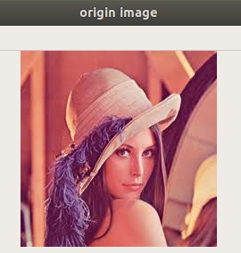
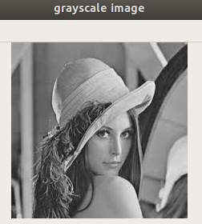
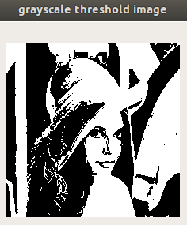
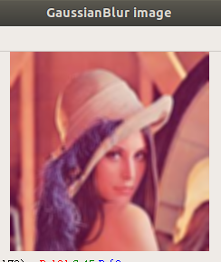
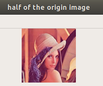
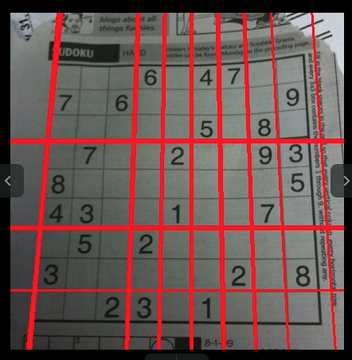
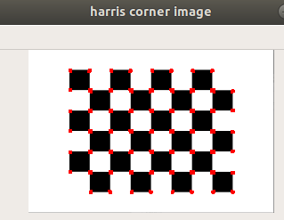
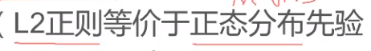
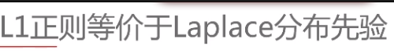

### FAQ
问问题，找对对象很重要

1. 课程什么时候可以看，课程还没有开通之类的问题，找班班，着急的话@一下就好
2. 助教的话，理论上是每天都有一个人值班的，@助教的话，最好是和课程相关的问题
3. 机器的话，一般的960, 1050, 1080Ti显卡就可以(显存大一点好些，大于等于4G)，不一定需要20x系列的显卡，高级部分之前一般的电脑都吃的消(在CPU上跑代码也行)，后期tinymind还会给大家分配GPU点数，内存(最好加到16G，12G，8G也可以)
4. 如果需要向助教或者班班提问，[请到这里开一个issue](https://gitee.com/maoxianxin19960229/note/issues)，然后在微信群里冒个泡，最好@一下助教，QQ群是放资料的地方，灌水的话，大家尽量去QQ群，哈哈
5. 开发环境推荐ubuntu18.04，[参考链接](https://blog.csdn.net/qq_36490878/article/details/80551890)，[安装完之后要安装的东西](https://www.cnblogs.com/dwsun/p/7767210.html)，[开发必备](https://blog.csdn.net/qq_24683561/article/details/96478537)，实在不行先装个虚拟机吧，如果自己实在装不上系统，去电脑店里让老板装也可以，几十块钱
6. 双系统问题，18年往后出产的笔记本，大多是一块固态硬盘，一块机械硬盘，所以可以一个装Windows，一个装Linux
7. 环境问题中的[Opencv安装](https://www.tinymind.cn/ai-materials/303-cv-opencv/303-cv-opencv-02/)，注意了，如果仅仅使用python的话，只需要pip install opencv-python，如果是使用C++编程的，则需要编译安装Opencv，还有像Opencv之类的工具，其实都是有官网的
8. 什么时候直播班班会通知大家的，大家不用着急，错过直播的话可以看录播
9. 在码云上建仓库的时候一定要设置为公开，要不然助教无法查看你的作业
10. 至于课程用的工具，我们说了作业提交代码要能在jupyter notebook上运行，这样我们也好检查，开发的话给你们推荐的是vs code，不过使用pycharm也可以，至于tensorflow和scikit-learning之类的开发包，这个你们先跟着课程学就知道了
11. 平时有问题在微信上讨论吧，QQ群的不关注，主要考虑群比较多的原因，大家谅解
12. 作业提交的话，建一个仓库就好，文件夹的命名参考课程的章节名称，目录结构采用[这种方式](https://github.com/tensorflow/tensorflow/tree/master/tensorflow)
13. 提问之前请多尝试，可以参考下，[我第一次是如何到stackoverflow上提问的](https://stackoverflow.com/questions/51340559/using-tensorflow-when-training-loss-cant-dropdown)，注意请自己多尝试，多用关键词去网上搜索
14. 关于代码问题，请分享代码文件，使助教可以复现代码错误
15. [课程参考资料](https://www.tinymind.cn/ai-materials/)
16. 问问题之前先尝试下在[Github Issue](https://github.com/tensorflow/tensorflow/issues)和[Stackoverflow](https://stackoverflow.com/)提问，最后提问题的地方在[这儿](https://gitee.com/maoxianxin19960229/note/issues)，开一个issue就好

### 课程问题
1. [HSI和HSV的区别](https://www.cnblogs.com/wxl845235800/p/7692542.html)

### 计算机视觉引论
#### Linux入门简易教程
1. 看完之后我觉得大家都应该装 Linux的，至少装个虚拟机先吧，体验一下先
2. 如果对Linux不熟悉的学员还是有必要看看这个视频的
3. [视频下面的配套说明文档](https://dwsun.blog.csdn.net/article/details/90633971)里的terminator(终端会话管理软件)和shutter(截屏软件)可以装一下

#### 第一章~第二章: 计算机视觉引论及数字成像系统
##### 第一章

1. 人的眼睛接收到外界信息，同时可以感受到不同物体之间的相对距离，也可以理解为深度信息，不是有个摄像头RGBD嘛，D就是Depth
2. 人、车、房子在什么位置涉及到目标检测，目标在做什么涉及到行为分析，目标之间的关系涉及到推理了吧，有个东西叫image caption


1. 人的视觉系统是分层处理的，对应于卷积神经网络(用于图像分类和图像检测等)的不同层


上图为视觉系统构成要素
视觉系统中光照很重要，因为光照影响着图像信息的输入，所以有时候会用到补光灯(光补偿)

1. 改变图片大小
```
cv2.resize()
```

2. 图像平滑






```
高斯平滑(滤波): 可以去除原始图片中的噪声，但是也会使图像变得模糊和透明，参考链接(https://en.wikipedia.org/wiki/Gaussian_blur)
cv2.GaussianBlur(img,(5,5),cv2.BORDER_DEFAULT)

import cv2

img = cv2.imread('/home/mao/Desktop/lena.jpeg')
#show origin image
cv2.imshow("origin image", img)
cv2.waitKey()
cv2.destroyAllWindows()

img_grayscale = cv2.cvtColor(img, cv2.COLOR_BGR2GRAY)
#show grayscale image
cv2.imshow("grayscale image", img_grayscale)
cv2.waitKey()
cv2.destroyAllWindows()

ret, img_threshold = cv2.threshold(img_grayscale, 127, 255, cv2.THRESH_BINARY)
#show grayscale threshold image
cv2.imshow("grayscale threshold image", img_threshold)
cv2.waitKey()
cv2.destroyAllWindows()

img_GaussianBlur = cv2.GaussianBlur(img,(5,5),cv2.BORDER_DEFAULT)
#show GaussianBlur image
cv2.imshow("GaussianBlur image", img_GaussianBlur)
cv2.waitKey()
cv2.destroyAllWindows()

img_half = cv2.resize(img, (int(img.shape[0]/2), int(img.shape[1]/2)))
#show half of the origin image
cv2.imshow("half of the origin image", img_half)
cv2.waitKey()
cv2.destroyAllWindows()
```

3. 颜色空间转换和阈值化
```
cv2.cvtColor()   可以转化成grayscale
cv2.threshold()   可以对图像进行二值转化
```
[opencv: 阈值处理(cv2.threshold) 探究(图示+源码)](https://blog.csdn.net/JNingWei/article/details/77747959)

4. 相机(三维视觉传感器): RGB+红外(红外发射和接收, 实现三维深度信息感知)
5. opencv读取图片是BGR的形式
6. Marr的视觉设计理论


机器视觉的总体概览


从低级特征到高级特征，就像卷积神经网络一样通过不断的卷积，提取到更高级的特征


通过part部分来组合成所表示的物体


自动提取特征+度量学习


课程架构及组织


机器视觉架构及组织

##### 第二章
7. 光补偿:

互补色: 颜料红+颜料青，涂在白纸上的同一点，会显示黑色，如果白纸上的字体为红色，再涂上青色背景，则会在视觉效果上形成强烈刺激,色彩对比达到最大的程度，[参考链接](https://baike.baidu.com/item/%E4%BA%92%E8%A1%A5%E8%89%B2)，光源红+光源青混合则变成白色
对比色 :互补色对比，两颜色间是180度距离，对比色对比，两颜色之间是120度距离，中差色对比则是90度距离，[参考链接](https://baike.baidu.com/item/%E5%AF%B9%E6%AF%94%E8%89%B2)


RGB和CMYK颜色模型


HSI和RGB都是三通道，如果只有单通道的话就是灰度图，三通道时，H控制纯色属性(决定是红色或者黄色等)，S控制色彩的鲜艳程度，V控制光强度
亮度I: 像素值大小，我们可以看到黑白电视(灰度图)，其实也能正常看的清楚(包含信息)，与H和S无关


[HSV和HSI的区别](https://www.cnblogs.com/wxl845235800/p/7692542.html)


b, c, d对应RGB
e(对应颜色分配), g, f(可以联想黑白电视)对应HSI

程序实例和结果展示:

```
import cv2

img = cv2.imread('/home/mao/Desktop/lena.jpeg')
img_grayscale = cv2.cvtColor(img, cv2.COLOR_BGR2GRAY)

cv2.imshow("origin image", img)
cv2.imshow("grayscale image", img_grayscale)
cv2.waitKey()

hsv = cv2.cvtColor(img, cv2.COLOR_BGR2HSV)

cv2.imshow("Hue", hsv[:,:,0])
cv2.imshow("Saturation", hsv[:,:,1])
cv2.imshow("Value", hsv[:,:,2])
cv2.waitKey()

cv2.imshow("Blue", img[:,:,0])
cv2.imshow("Green", img[:,:,1])
cv2.imshow("Red", img[:,:,2])

cv2.waitKey()
cv2.destroyAllWindows()
```


value的显示图全是白色(视频中说因为都是纯色的原因)，[参考链接](https://blog.csdn.net/taily_duan/article/details/51506776)，猜测是像素值为255的原因


像素值计算方式


人眼的视觉感应和照明值的关系是非线性的，所以需要Y矫正(比如说像素值取值范围是0-255，如果除以255，那么就转化为0-1了, 先值域缩放，把非均匀量化，转化为均匀量化)，存储时需要除以2.2(量化后进行存储)，显示时需要乘以2.2(转换为符合人的视觉特征)

### 视觉处理与分析
#### 第一章~第二章: 计算机视觉处理算法基础及视觉特征提取
##### 第一章


图像预处理滤波可实现对输入图片去噪(噪声是图像中像素值突变的地方)等作用，为后续的分割等任务做铺垫，这里用的是传统的分割方法，深度学习里叫instance segmentation


给两个参考链接吧，第一个链接[A Comprehensive Guide to Convolutional Neural Networks — the ELI5 way](https://towardsdatascience.com/a-comprehensive-guide-to-convolutional-neural-networks-the-eli5-way-3bd2b1164a53)
第二个链接[Convolution](https://en.wikipedia.org/wiki/Convolution)，看完这两个之后，我个人觉得你对什么是卷积该有一定的了解了


左侧叫4邻域，中间叫8邻域
```
cv2.blur()
```
这里的滤波器或者说卷积核的形状有3x3的正方形，有十字形的，虽然讲的只是平均滤波，但也说明滤波器可以有各种各样的形状，可以参考下面[这个链接](https://en.wikipedia.org/wiki/Gaussian_blur)，可以注意里面的bokeh effect关键词，说明了不同形状的滤波器会产生不同的效果


中值滤波对去除椒盐噪声很有效，看下面展示的效果图
```
cv2.medianBlur()
```

虽然神经网络的卷积核和这里讲到的各种滤波器没什么区别，但是卷积核融入到了整个网络中，做到了end-to-end的优化，所以起到的作用也自然比手工特征选择的滤波器更好


还真是第一次接触到图像形态学这个东西


```
cv2.morphologyEx()
```
缺点: 信息会损失，所以有些地方可能会出现马赛克

下面是平均滤波，中值滤波，形态学运算的结果

```
import cv2

img = cv2.imread('/home/mao/Desktop/lena.jpeg')

#show origin image
cv2.imshow("origin image", img)
cv2.waitKey()

img_average = cv2.blur(img, (5,5))
#show average image
cv2.imshow("average image", img_average)
cv2.waitKey()

img_median = cv2.medianBlur(img, 3)
#show median image
cv2.imshow("median image", img_median)
cv2.waitKey()

img_morphology_open = cv2.morphologyEx(img, cv2.MORPH_OPEN, (3,3))
img_morphology_close = cv2.morphologyEx(img_morphology_open, cv2.MORPH_CLOSE, (3,3))
#show morphology image
cv2.imshow("morphology image", img_median)
cv2.waitKey()

cv2.destroyAllWindows()
```


边缘检测用的是high pass filter，之前图像的平滑使用的是low pass filter(高斯滤波)
微分(求导，求极值点)和差分(求偏导的意思)
边缘检测的本质是微分，一阶导的极值点，二阶导的过零点(Laplace算子)


Log算子(先对图像进行高斯滤波，实现去噪，再用Laplace算子检测边缘)


对于为什么分X轴方向和Y轴方向的理解，区域跳变的地方存在极值点，而极值点是在边缘线上(该篇总结指的是白色对应像素值为255)的点，那么X轴方向上的极值点和Y轴方向上的极值点都是一维的，如何联系到二维的极值点呢，一维扩展成二维可以通过平移的形式(想像山脉的样子，保留一个看法，一维扩展到二维是通过组合不同维度的方式来实现的)
算子是对一阶导(极值点)或者二阶导(过零点)来说的，原始图像求导后(想象成三维图的话)，那么山峰就是极值点了，而极值点在边缘线上，如果从图像层面来看，就会出现所谓的低级特征，或者说low-level的纹理特征。至于说的有些卷积核是训练出来的，这叫自动特征提取，这需要从网络结构层面来理解，特征提取+度量学习，做到了end-to-end训练，最终得到你想要的结果(训练过程中确定参数状态，也就是确定卷核的weights)


噪声也是跳变点，差分(用于检测边缘，特别是Laplace算子，因为求偏导的关系)对噪声不敏感，如果不在这之前进行去噪(比如高斯滤波)那么会出现很多误检


噪声可以使用高斯滤波来去除，断裂可以用自动边缘连接来解决，虚检(渐变灰度，容易检测出来多个边缘)可以通过梯度幅值进行非极大值抑制(在目标检测等中也有用到Non-maximum suppression)来解决，我个人觉得，当今的很多深度学习算法，吸收了传统算法的知识点


让我想起了姿态估计里的热偏置图


Sobel算子展示


```
import cv2

img = cv2.imread('/home/mao/Desktop/1.png')

cv2.imshow("origin image", img)
cv2.waitKey()

img_sobel_x = cv2.Sobel(img,cv2.CV_64F,dx=1,dy=0,ksize=5)
cv2.imshow("Sobel image xorder", img_sobel_x)
cv2.waitKey()

img_sobel_y = cv2.Sobel(img,cv2.CV_64F,dx=0,dy=1,ksize=5)
cv2.imshow("Sobel image yorder", img_sobel_y)
cv2.waitKey()

img_sobel_xy = cv2.Sobel(img,cv2.CV_64F,dx=1,dy=1,ksize=5)
cv2.imshow("Sobel image xyorder", img_sobel_xy)
cv2.waitKey()
```
Laplace算子，注意该算子计算的是二阶导，对于有一定宽度的边缘，容易出现双重响应(检测出来两条边缘)，[参考链接](https://blog.csdn.net/li_wen01/article/details/72864291)

```
img_laplace = cv2.Laplacian(img,cv2.CV_64F)
cv2.imshow("Laplace image", img_laplace)
cv2.waitKey()
```
Canny算子

最后的总代码如下，我们可以看到canny算子检测出来的边缘线更加的细，这说明Noise Reduction，Finding Intensity Gradient of the Image，Non-maximum Suppression，Hysteresis Thresholding起到作用了，[参考链接](https://opencv-python-tutroals.readthedocs.io/en/latest/py_tutorials/py_imgproc/py_canny/py_canny.html)

上图是加了高斯滤波之后检测出来的
```
import cv2

img = cv2.imread('/home/mao/Desktop/lena.jpeg')

cv2.imshow("origin image", img)
cv2.waitKey()

img = cv2.GaussianBlur(img,(3,3),cv2.BORDER_DEFAULT)

img_sobel_x = cv2.Sobel(img,cv2.CV_64F,dx=1,dy=0,ksize=5)
cv2.imshow("Sobel image xorder", img_sobel_x)
cv2.waitKey()

img_sobel_y = cv2.Sobel(img,cv2.CV_64F,dx=0,dy=1,ksize=5)
cv2.imshow("Sobel image yorder", img_sobel_y)
cv2.waitKey()

img_sobel_xy = cv2.Sobel(img,cv2.CV_64F,dx=1,dy=1,ksize=5)
cv2.imshow("Sobel image xyorder", img_sobel_xy)
cv2.waitKey()

img_laplace = cv2.Laplacian(img,cv2.CV_64F)
cv2.imshow("Laplace image", img_laplace)
cv2.waitKey()

img_canny = cv2.Canny(img,100,200)
cv2.imshow("Canny image", img_canny)
cv2.waitKey()
cv2.destroyAllWindows()
```

8. brightness和contrast


几种不同对比度的灰度直方图


这里的话，使用的是递归的两种方式(广度和深度，不太了解的话去搜索下吧)


上图是全局分割的大津算法和局部分割算法的结果图


对平移，旋转和比例缩放变换不敏感，这个在卷积神经网络中是个很重要的点


几种分割方法吧，后面没显示出来的是基于深度学习的分割方法，感兴趣的去搜索instance segmentation


就当做随便看看吧

米粒分割结果展示

```
import cv2
import copy

img = cv2.imread('/home/mao/Desktop/1.jpeg')
cv2.imshow("origin image", img)
cv2.waitKey()

#转化为灰度图, 用于区域分割
img = cv2.cvtColor(img, cv2.COLOR_BGR2GRAY)

#使用大津算法进行阈值分割
_, bw = cv2.threshold(img, 0, 0xff, cv2.THRESH_OTSU)
cv2.imshow("otsu threshold image", bw)
cv2.waitKey()

#定义一个十字形的滤波器
element = cv2.getStructuringElement(cv2.MORPH_CROSS, (3,3))
#使用开运算, 分格开粘连在一起的物体
bw = cv2.morphologyEx(bw, cv2.MORPH_OPEN, element)

seg = copy.deepcopy(bw)
#得到分割完后的各个区域的轮廓, 使用长方形来拟合米粒
cnts, hier = cv2.findContours(seg, cv2.RETR_EXTERNAL, cv2.CHAIN_APPROX_SIMPLE)
count =0

for i in range(len(cnts), 0, -1):
    c = cnts[i-1]
    #计算区域面积
    area = cv2.contourArea(c)
    if area < 10:
        continue
    count = count + 1
    print("blob", i, " : ", area)
    #获取左顶点坐标和对应的长宽
    x,y,w,h = cv2.boundingRect(c)
    cv2.rectangle(img, (x,y), (x+w, y+h), (0,0,0xff), 1)
    cv2.putText(img, str(count), (x,y), cv2.FONT_HERSHEY_PLAIN, 0.5, (0,0xff,0))

print("米粒数量: ", count)
cv2.imshow("show result", img)

cv2.waitKey()
cv2.destroyAllWindows()
```

##### 第二章


Hough变换主要分为两步走，第一步是边缘检测，第二步是统计交点个数并过滤，最后确定出直线的参数k和b，[参考链接](https://blog.csdn.net/abcjennifer/article/details/7448513)

实验结果:   [参考链接](https://opencv-python-tutroals.readthedocs.io/en/latest/py_tutorials/py_imgproc/py_houghlines/py_houghlines.html)

```
import cv2
import numpy as np

img = cv2.imread('/home/mao/Desktop/2.jpg')
gray = cv2.cvtColor(img,cv2.COLOR_BGR2GRAY)
edges = cv2.Canny(gray,50,150,apertureSize = 3)

cv2.imshow("edges image", edges)
cv2.waitKey()

lines = cv2.HoughLines(edges,1,np.pi/180,200)
print(lines.shape)
for i in range(lines.shape[0]):
    for rho,theta in lines[i]:
        a = np.cos(theta)
        b = np.sin(theta)
        x0 = a*rho
        y0 = b*rho
        x1 = int(x0 + 1000*(-b))
        y1 = int(y0 + 1000*(a))
        x2 = int(x0 - 1000*(-b))
        y2 = int(y0 - 1000*(a))

        cv2.line(img,(x1,y1),(x2,y2),(0,0,255),2)

cv2.imwrite('houghlines3.jpg',img)
```


Harris算子的角点检测

```
import cv2
import numpy as np

img = cv2.imread('/home/mao/Desktop/1.png')
gray = cv2.cvtColor(img,cv2.COLOR_BGR2GRAY)
gray = np.float32(gray)

#the input image must be float32
dst = cv2.cornerHarris(gray,2,3,0.04)

#result is dilated for marking the corners
dst = cv2.dilate(dst,None)

#Threshold for an optimal value, it may vary depending on the image.
img[dst>0.01*dst.max()]=[0,0,255]

cv2.imshow('harris corner image',img)
cv2.waitKey(0)
cv2.destroyAllWindows()
```

角点提取和匹配算法


SIFT对旋转、尺度缩放、亮度变化保持不变，这是一个很重要的特点，在训练模型的时候非常重要，还有个很重要的点是匹配
位置，尺度，方向，特征向量
通过特征向量实现匹配


所以一般的卷积核大小取3x3，因为计算量小很多，还有就是连续两个3x3卷积核的感受野大小和一个5x5的感受野大小相同，感兴趣的话去搜receptive field
右下图进行了padding操作，所以卷积过后，图片的大小不变


这个让我想起来MobileNet里的pointwise convolutional filters，也可以理解为卷积核分解


神经网络里也有特征金子塔的设计用于多尺度的物体检测，感兴趣的话去搜索FPN(Feature Pyramid Network)


这里的尺度空间因子，可以理解为卷积核的大小，这里有兴趣的话，可以去查查一个概念叫感受野(receptive field)


Tensorflow中的图像输入是NHWC(N指代batch size，H指代height，W指代width，C指代channel)，所以这里的Octave可以理解为channel


特征点的检测要通过极值点的检测


对极值点进行优化，以找到真正的关键点，采用插值的方式


我们要注意消除边缘响应的特征点(实际为误检的点)


在数学上，我们可以通过计算梯度来求极值点，那么我们接着需要做的是把关键点的定位和极值点联系起来


恰恰是这15%的关键点对稳定匹配起到关键作用，这个让我想起来，神经网络中的某些神经元，对最终的分类结果起到决定性作用或者说起到很大作用


特征向量生成步骤


其实keypoint在关键点检测中也是很重要的，有点像热偏置图中的关键点定位，感兴趣搜搜姿态估计(pose estimation)


所以有了进一步的变种SURF和ORB(在机器人SLAM中使用特别广泛)算子


SIFT结果展示

```
import cv2

img = cv2.imread('/home/mao/Desktop/1.jpg')
gray= cv2.cvtColor(img,cv2.COLOR_BGR2GRAY)

sift = cv2.xfeatures2d.SIFT_create()
kp = sift.detect(gray,None)

cv2.drawKeypoints(gray,kp,img)

cv2.imwrite('sift_keypoints.jpg',img)
```


以上为oFAST算子提取特征点的步骤
特征点(位置，尺度，方向)
描述子(特征向量)


ORB算子的结果展示

```
import cv2
from matplotlib import pyplot as plt

img = cv2.imread('/home/mao/Desktop/1.jpg',0)

#Initiate STAR detector
orb = cv2.ORB_create(scoreType=cv2.ORB_FAST_SCORE)

#find the keypoints with ORB
kp = orb.detect(img)

#compute the descriptors with ORB
kp, des = orb.compute(img, kp)

#draw only keypoints location,not size and orientation
img2 = cv2.drawKeypoints(img,kp,None,color=(0,255,0), flags=0)
plt.imshow(img2)
plt.show()
```


#### 第三章: 运动估计


采用帧差法提取出来的运动目标，存在空洞，这对后续的特征点提取会造成麻烦，而且由于相邻两帧相减会造成噪声被放大


高斯背景: 假设一段时间为3s，那么从t=0到t=3(一秒30帧的话，总的帧数就是90)，对某个像素点进行统计，得到如上图的结果，知道均值和方差后，我们可以根据上述公式判断t=3时刻该像素点是foreground还是background


这个具体的话就看视频吧，讲的还是比较详细的，可以多听两次，看了这篇参考之后，我认为混合高斯模型还是属于background subtraction，[Tracking Multiple Moving Objects Using Gaussian Mixture Model](http://citeseerx.ist.psu.edu/viewdoc/download?doi=10.1.1.649.8642&rep=rep1&type=pdf)，[Gaussian Mixture Model](https://brilliant.org/wiki/gaussian-mixture-model/#)


[视频下载地址](https://github.com/opencv/opencv/blob/master/samples/data/vtest.avi)
[代码链接](https://github.com/opencv/opencv/blob/3.4/samples/python/tutorial_code/video/background_subtraction/bg_sub.py)
[opencv官网参考链接](https://docs.opencv.org/3.4/d1/dc5/tutorial_background_subtraction.html)
```
from __future__ import print_function
import cv2 as cv
import argparse

parser = argparse.ArgumentParser(description='This program shows how to use background subtraction methods provided by \
                                              OpenCV. You can process both videos and images.')
parser.add_argument('--input', type=str, help='Path to a video or a sequence of image.', default='vtest.avi')
parser.add_argument('--algo', type=str, help='Background subtraction method (KNN, MOG2).', default='MOG2')
args = parser.parse_args()

## [create]
#create Background Subtractor objects
if args.algo == 'MOG2':
    backSub = cv.createBackgroundSubtractorMOG2()
else:
    backSub = cv.createBackgroundSubtractorKNN()
## [create]

## [capture]
capture = cv.VideoCapture(cv.samples.findFileOrKeep(args.input))
if not capture.isOpened:
    print('Unable to open: ' + args.input)
    exit(0)
## [capture]

while True:
    ret, frame = capture.read()
    if frame is None:
        break

    ## [apply]
    #update the background model
    fgMask = backSub.apply(frame)
    ## [apply]

    ## [display_frame_number]
    #get the frame number and write it on the current frame
    cv.rectangle(frame, (10, 2), (100,20), (255,255,255), -1)
    cv.putText(frame, str(capture.get(cv.CAP_PROP_POS_FRAMES)), (15, 15),
               cv.FONT_HERSHEY_SIMPLEX, 0.5 , (0,0,0))
    ## [display_frame_number]

    ## [show]
    #show the current frame and the fg masks
    cv.imshow('Frame', frame)
    cv.imshow('FG Mask', fgMask)
    ## [show]

    keyboard = cv.waitKey(30)
    if keyboard == 'q' or keyboard == 27:
        break
```


用混合高斯模型提取运动目标和运动轨迹，这个需要再查查资料补充，[参考链接](http://citeseerx.ist.psu.edu/viewdoc/download?doi=10.1.1.649.8642&rep=rep1&type=pdf)


[有用的参考链接](https://github.com/opencv/opencv/tree/3.4/samples/python/tutorial_code/video)

[什么是optical flow](https://en.wikipedia.org/wiki/Optical_flow) describe the visual stimulus provided to animals moving through the world，对应到视觉输入上的理解就是Optical flow can also be defined as the distribution of apparent velocities of movement of brightness pattern in an image

[什么是Lucas–Kanade method](https://en.wikipedia.org/wiki/Lucas%E2%80%93Kanade_method)


因为使用的是泰勒展开(某一点的邻域处比较)，所以x和y的变化要足够小，对应到后续的相邻两帧运动间隔足够小，如果是对于大位移呢？ 后续用到了L-K金字塔来解决
求偏导时用差分来代替


灰度连续变化，根据像素的变化，推出物体运动了多少(上图3x3的中心点)，光流估计最基本思想


矩阵是否可逆和特征值有关系


角点位置有2个比较大的特征值，此时L-K估计的会比较好(L-K估计和特征点的关系)


要想L-K估计的准，要有明显的灰度差别(x和y两个方向)


光流金字塔需要计算optical flow(用d来表示)和affine transformation matrix(用A来表示)

注意这里提到的initial guess for the pixel displacement(用于计算位置) and the affine transformation(对应着旋转等变化)，我觉得这里可以回忆一下之前SIFT提到的位置，方向，尺度(这里处于同一个level)，让我们来看看在L层计算出的optical flow和affine transformation matrix，用于估计L-1层的物体位置，一直propagate到L=0层，最终估计出来的点和实际的点就存在一个matching error(我们的目标是最小化这个error)，一旦这个error被优化为0，那么我们就可以实现在high level计算optical flow和affine transformation matrix，然后再propagate回low level的统一，[详细看这个error如何优化的看这个](http://robots.stanford.edu/cs223b04/algo_tracking.pdf)


要想L-K估计的准，要有明显的灰度差别(x和y两个方向)


相邻两帧运动间隔足够小，同一个点在相邻两帧亮度近似保持不变


光流估计代码
```
import cv2

videoFileName = 'vtest.avi'

#角点检测参数
feature_params = dict(maxCorners = 100,
                      qualityLevel = 0.3,
                      minDistance = 7,
                      blockSize = 7)

#Lucas-Kanade光流法参数
lk_params = dict(winSize = (15,15),
                 maxLevel = 2,
                 criteria = (cv2.TERM_CRITERIA_EPS | cv2.TERM_CRITERIA_COUNT, 10, 0.03))

cap = cv2.VideoCapture(videoFileName)

#计算第一帧特征点
ret, prev = cap.read()
prevGray = cv2.cvtColor(prev, cv2.COLOR_BGR2GRAY)
p0 = cv2.goodFeaturesToTrack(prevGray, mask=None, **feature_params)

while True:
    ret, frame = cap.read()
    if not ret:
        break

    gray = cv2.cvtColor(frame, cv2.COLOR_BGR2GRAY)

    #计算光流
    p1, st, err = cv2.calcOpticalFlowPyrLK(prevGray, gray, p0, None, **lk_params)
    #选取好的跟踪点
    goodPoints = p1[st==1]
    goodPrevPoints = p0[st==1]

    #在结果图像中叠加画出特征点和计算出来的光流向量
    res = frame.copy()
    drawColor = (0, 0, 255)
    for i, (cur, prev) in enumerate(zip(goodPoints, goodPrevPoints)):
        x0, y0 = cur.ravel()
        x1, y1 = cur.ravel()
        cv2.line(res, (x0, y0), (x1, y1), drawColor)
        cv2.circle(res, (x0, y0), 3, drawColor)

    #更新上一帧
    prevGray = gray.copy()
    p0 = goodPoints.reshape(-1, 1, 2)

    #显示计算结果图像
    cv2.imshow("results", res)

    key = cv2.waitKey(30)
    if key == 27: #按下ESC退出
        break
```

### 机器学习入门
#### 第一章~第二章: 机器学习简介及线性回归
##### 第一章


1. numpy
2. scipy
3. pandas
4. matplotlib
5. seaborn
6. scikit-learn


##### 第二章


这里的RSS可以当做loss function，也是optimizer的目标
residual在ResNet中有用到，到时候可以查查资料


如果有噪声的话，可以选择Huber损失


可以稍微解释下这里的正相关和负相关


可以查查normalize有哪些


去量纲(不同的特征有不同的单位，同时取值范围也不一样，这时候我们需要对它们进行标准化处理，把它们的取值范围缩放到[0, 1])





validation dataset是从training dataset上分割出来的